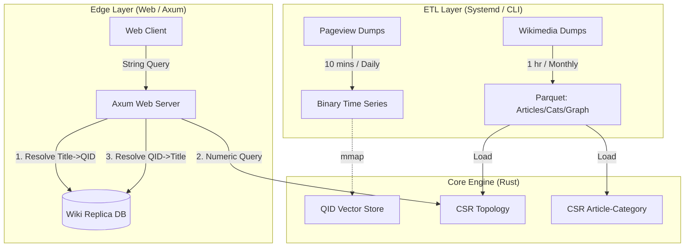

# TopicTrends: High-Performance Cross-Lingual Wikipedia Topic Analytics Engine

**Architecture Design Document**

## 1. Summary
**TopicTrends** is a specialized high-performance analytics engine designed to ingest, model, and query Wikipedia pageview data across **345+ language editions**. Unlike general-purpose databases, TopicTrend utilizes **Data-Oriented Design (DOD)** principles in Rust to achieve sub-millisecond graph traversals and real-time trend analysis.

A key architectural distinction is the system's reliance on **Wikidata QIDs** as the internal numeric currency. This decouples the analytics engine from language-specific titles, paving the way for cross-lingual topic analysis while maintaining a strict low-latency budget (< 1s) for web-facing dashboards.

URL: https://topictrends.wmcloud.org/

## 2. Problem Modeling & Scale

### 2.1 The Data Domain (English Wikipedia Baseline)
*   **Articles:** ~7 Million.
*   **Categories:** ~2.5 Million.
*   **Graph Density:** A massive **196 Million** Article $\to$ Category relationships.
*   **Topology:** The category graph is a **Directed Cyclic Graph** (DAG with cycles), not a strict tree.
*   **Metrics:** Time-series pageview data processed daily.

### 2.2 The Multi-Wiki Challenge
*   **Scope:** 345 active Wikipedia language editions.
*   **Throughput:** The system must ingest daily traffic logs for all wikis within a tight operational window.
*   **Normalization:** Titles vary by language ("Physics", "Physique", "Physik"), but the concept is universal.

### 2.3 The Solution: QID-Centric Numerics
To solve the normalization and performance problem simultaneously, TopicTrend enforces a strict **"No Strings"** policy within the core engine.
*   **Universal ID:** We utilize the Wikidata QID (e.g., `Q42`).
*   **Numeric Storage:** The 'Q' is stripped, storing the ID as a native `u32` (e.g., `42`).
*   **Rationale:** `u32` operations are atomic and SIMD-friendly. QIDs provide a stable, language-agnostic reference, enabling future features where trends in the English "Physics" category can be correlated with the German "Physik" category automatically.

---

## 3. System Architecture

### 3.1 High-Level Data Flow



### 3.2 Key Architectural Decisions

#### A. QID as the Numeric Atom
The core engine knows nothing of strings. It operates exclusively on `u32` QIDs.
*   **Storage:** `Vec<u32>` and `CsrAdjacency`.
*   **Translation Layer:** The translation from "User Readable Title" to "System QID" is pushed to the **Edge Layer**. The Web Server performs a fast lookup against a local Wikipedia Database Replica (MariaDB/MySQL) only when resolving input/output.
*   **Benefit:** The core analytics engine is pure math, unencumbered by string encoding, localization, or storage overhead.

#### B. Compressed Sparse Row (CSR) for Massive Density
English Wikipedia has **196 Million** article-category links.
*   **Naive Approach:** `Vec<Vec<u32>>` would incur a 24-byte header overhead per article, plus heap fragmentation.
*   **TopicTrend Approach:** A flattened CSR structure.
    *   `offsets`: ~7M entries (28MB).
    *   `targets`: 196M entries (784MB).
*   **Impact:** The entire mapping fits in **< 1GB RAM** with perfect cache locality. This allows the "Scatter" phase of trend analysis to saturate memory bandwidth.

#### C. Memory-Mapped Time Series
*   **Throughput:** The system processes daily pageviews for **345 wikis in 10 minutes**.
*   **Format:** Per-day, per-wiki binary files.
*   **Mechanism:** `bzip2` stream $\to$ Rust Parser $\to$ Binary Write.
*   **Access:** The web server `mmap`s these files. For a year of data, the OS handles paging, keeping the "hot" recent days in RAM while cold storage sits on disk.

---

## 4. Operational Pipeline & Performance

The system is orchestrated via `systemd` timers and a highly optimized `Makefile`.

### 4.1 Daily Ingestion (The 10-Minute Job)
*   **Task:** Download compressed pageview logs, parse lines, map titles to QIDs, sum views, and write binary vectors for 345 wikis.
*   **Performance:** ~10 Minutes total.
*   **Efficiency:** Uses streaming I/O to ensure RAM usage remains constant regardless of dump size.

### 4.2 Bootstrap / Refresh (The 1-Hour Job)
*   **Task:** Fetch all Articles, Categories, Graphs, and Mappings for 345 wikis.
*   **Source:** Wikimedia SQL Replicas.
*   **Frequency:** Weekly or Monthly (Topology changes slowly).
*   **Performance:** ~1 Hour total.
*   **Output:** Highly compressed Parquet files used to hydrate the in-memory graph on server restart.

---

## 5. Web Interface & API Layer

The web layer is built on **Axum** (Rust), designed to be a thin wrapper around the core engine. All endpoints operate with a strict **< 1 Second** latency budget.

### 5.1 API Endpoints

| Endpoint | Description | Implementation |
| :--- | :--- | :--- |
| `GET /api/pageviews/category` | Recursive pageviews for a category tree. | Uses **Reverse Depth Propagation** ($O(E)$). |
| `GET /api/pageviews/article` | Raw daily views for a specific QID. | Direct `mmap` array slice access ($O(1)$). |
| `GET /api/list/sub_categories` | Navigation helper. | CSR Adjacency lookup ($O(1)$). |
| `GET /api/list/top_categories` | Finds trending topics within a time range. | **Reverse Scatter** algorithm ($O(N_{articles})$). |

### 5.2 The Resolution Strategy
1.  **Request:** User asks for "Physics".
2.  **Lookup:** Axum queries local DB: `SELECT qid FROM page WHERE title = 'Physics'`. Result: `42`.
3.  **Process:** Core engine runs algorithms on `42`. Result: Top child is `99` with 1M views.
4.  **Resolve:** Axum queries local DB: `SELECT title FROM page WHERE qid = 99`. Result: "Quantum Mechanics".
5.  **Response:** JSON `{ "category": "Quantum Mechanics", "views": 1000000 }`.

---

## 6. Algorithms & Complexity Analysis

### 6.1 Recursive Aggregation (Level-Wise Propagation)
To aggregate views for a category and all its 20 levels of subcategories (without double-counting or infinite loops):
1.  **Pre-computation:** The graph depth is analyzed once. (English Wiki Max Depth $\approx$ 19).
2.  **Runtime:** We iterate depths from $19 \to 1$. Scores from depth $N$ are added to parents at $N-1$.
3.  **Complexity:** $O(E)$ (Linear to the number of edges).
4.  **Speed:** ~20ms for the entire graph.

### 6.2 Trending Category Discovery
To find which categories are trending without checking all 2.5 million of them:
1.  **Scatter:** We iterate the *Articles* (which contain the view data).
2.  **Accumulate:** For each article with views, we push the score to its parent categories via the CSR link.
3.  **Lazy Resolution:** We only resolve QIDs to Titles for the final "Top 20" list.

---

## 7. Cross-Lingual Analysis

The decision to use **QIDs** as the primary key is strategic.
*   **Current State:** Isolated analysis of English, German, French, etc.
*   **Future State:**
    *   Since `Q42` represents "Douglas Adams" in *all* 345 wikis:
    *   We can sum vectors across languages: `Global_Views(Q42) = En_Views(Q42) + De_Views(Q42) + ...`
    *   **Result:** A global "Topic Trend" dashboard that identifies viral topics regardless of the language they originated in.

## 8. Semantic Topic Search

### 8.1 Overview & Motivation

Traditional keyword-based search fails when users search for concepts rather than exact phrases. For example:
*   Query: "machine learning" → Does **not** find "neural networks", "deep learning", or "artificial intelligence"
*   Query: "climate change" → Misses "global warming", "greenhouse effect", "carbon emissions"

**TopicTrends solves this with semantic search**, powered by **neural embeddings** and **vector similarity**. The system understands that "machine learning" and "neural networks" are semantically related, even though they share no keywords.

**Key Capability:** Search 2.5M+ Wikipedia categories by *meaning* instead of *text matching*, across all 345 Wikipedia languages.

### 8.2 Architecture: Embedding Service + Vector Database

The semantic search system is built as a **microservice architecture**:

```
┌─────────────────────────────────────────────────────────────┐
│  TopicTrends Web Server (Rust / Axum)                       │
│  ┌───────────────────────────────────────────────────────┐  │
│  │  Handler: GET /api/search/categories                  │  │
│  │  • Parse query & wiki parameters                      │  │
│  │  • Call topictrend_taxonomy::search()                 │  │
│  │  • Filter by match_threshold (default: 0.6)           │  │
│  │  • Translate results to target wiki language          │  │
│  └──────────────┬────────────────────────────────────────┘  │
└─────────────────┼──────────────────────────────────────────┘
                  │ (Async gRPC calls)
                  │
      ┌───────────┴──────────────┐
      │                          │
      ▼                          ▼
┌──────────────────────┐  ┌──────────────────────┐
│ Embedding Service    │  │ Qdrant Vector DB     │
│ (Python gRPC)        │  │ (HTTP API)           │
│                      │  │                      │
│ • Model:             │  │ • Store: 384-dim     │
│   Qwen3-Embedding-   │  │   vectors            │
│   0.6B               │  │ • Index: HNSW        │
│ • Dimensions: 384    │  │ • Metric: Cosine     │
│ • Port: 50051        │  │   similarity         │
│                      │  │ • Collections:       │
│ RPC Methods:         │  │   {wiki}-categories  │
│ • Encode(texts)      │  │ • Port: 6334         │
│ • ComputeSimilarity  │  │                      │
└──────────────────────┘  └──────────────────────┘
```

**Separation of Concerns:**
*   **Embedding Service:** Stateless Python gRPC server running the ML model. Can be scaled horizontally.
*   **Vector Database:** Persistent storage for embeddings with optimized nearest-neighbor search. Handles queries independently.
*   **Rust Core:** Orchestrates the search flow, translates QIDs to titles, ensures cross-wiki consistency.

### 8.3 Technical Implementation Details

#### 8.3.1 Embedding Model: English-Only Architecture

**Design Decision: English-Only Embeddings**

Rather than maintaining embeddings for 345 different Wikipedia languages, TopicTrends uses a **single English embedding model** for all languages. This clever design minimizes storage and computational complexity while preserving cross-lingual capabilities through QID translation.

**Why this approach?**
*   **Simpler infrastructure:** One embedding model + one vector database instead of 345
*   **Consistent semantics:** All searches leverage English Wikipedia's large, well-linked knowledge graph
*   **Cross-lingual support via QID:** Results are automatically available in any target language through Wikidata QID mapping
*   **Single point of optimization:** Can focus ML effort on one high-quality English model

**Model: English-Only Sentence Transformer**

The system uses an English sentence transformer model (384-dimensional embeddings):

**Configuration** (services/embedding/.env):
```
MODEL_NAME=sentence-transformers/all-MiniLM-L12-v2
EMBEDDING_DIMENSION=384
```

**Key properties:**
*   **Dimensions:** 384 (compact, fast computation)
*   **Language:** English only
*   **Speed:** Optimized for fast inference on CPU/GPU
*   **Semantic Quality:** Purpose-built for similarity search

**Asymmetric Encoding** (Critical for search quality):
```python
# For documents (English category titles):
category_embedding = model.encode("Machine Learning", prompt_name=None)

# For user queries (English only):
query_embedding = model.encode("How do computers learn?", prompt_name="query")
```

The `prompt_name="query"` adds a specialized instruction prompt that tells the model: *"This is a search query, optimize for finding relevant documents."* This asymmetry improves recall compared to symmetric search, ensuring queries find semantically related documents even with different phrasing.

#### 8.3.2 Embedding Data: English Category Titles Only

Only **English Wikipedia category titles** are embedded and stored in Qdrant. This single collection serves all 345 Wikipedia languages:

```
Data Pipeline:
┌──────────────────────┐
│ enwiki/categories.   │  ← Load English titles only
│ parquet              │     (QID, page_title in English)
└──────────┬───────────┘
           │
           ▼
┌──────────────────────┐
│ Batch Process        │  ← Process 100 at a time
│ (100 titles/batch)   │
└──────────┬───────────┘
           │
           ▼
┌──────────────────────┐
│ Embedding Service    │  ← Generate 384-dim vectors
│ (English model)      │     for English text only
└──────────┬───────────┘
           │
           ▼
┌──────────────────────┐
│ Qdrant Vector DB     │  ← Single collection:
│ enwiki-categories    │     {QID → vector, English title}
└──────────────────────┘
```

**Key insight:** Categories are embedded **once** with English titles, then results are translated to target languages on-demand using QID lookup. No redundant embeddings for German, French, or Portuguese versions of the same concept.

#### 8.3.3 Qdrant Vector Storage & Indexing

**Single Collection for All Languages**

A single Qdrant collection `enwiki-categories` stores embeddings for all 2.5M English Wikipedia categories:

**Collection Creation:**
```rust
CreateCollectionBuilder::new("enwiki-categories")
    .vectors_config(
        VectorParamsBuilder::new(384, Distance::Cosine)
            .on_disk(true)  // Vectors stored on disk to handle 2.5M categories
            .build()
    )
    .quantization_config(
        ScalarQuantizationBuilder::new()
            .always_ram(true)  // Keep quantized data in RAM for speed
            .build()
    )
    .hnsw_config(HnswConfigDiffBuilder::default().inline_storage(true).build())
```

**Point Structure** (one per English category):
```rust
PointStruct {
    id: 12345,              // Category QID (u64)
    vector: vec![...],      // 384-dimensional embedding of English title
    payload: {
        "qid": 12345,
        "page_title": "Machine Learning"  // English title only
    }
}
```

**Search Operation:**
```rust
search_points(
    SearchPointsBuilder::new("enwiki-categories", query_embedding, limit)
        .with_payload(true)  // Return metadata
        .params(SearchParamsBuilder::default().exact(true))
)
```

*   **Distance:** Cosine similarity (measures angle between vectors)
*   **Single Index:** All 2.5M categories indexed once, reused for all language searches
*   **Result:** QID + English title + similarity score (0.0 = opposite, 1.0 = identical)

### 8.4 API Endpoint: /api/search/categories

**Route Definition** (topictrend_web/src/main.rs:78):
```rust
.route("/api/search/categories", get(handlers::search_categories))
```

**Request Parameters:**

| Parameter | Type | Required | Default | Description |
| --- | --- | --- | --- | --- |
| `query` | String | Yes | — | English search query (e.g., "machine learning") |
| `wiki` | String | Yes | — | Target wiki for result language (e.g., "enwiki", "frwiki", "dewiki") |
| `match_threshold` | f32 | No | 0.6 | Min. similarity score (0.0–1.0) |
| `limit` | u64 | No | 1000 | Max. results to return |

**Important:** The `query` parameter must be in **English**. The embedding model only understands English semantics. However, results can be returned in any target language via the `wiki` parameter.

**Example Request:**
```bash
# Search for "artificial intelligence" in English, return results in English
curl "http://localhost:8000/api/search/categories?wiki=enwiki&query=artificial+intelligence&match_threshold=0.7&limit=10"

# Same search, but return results in French
curl "http://localhost:8000/api/search/categories?wiki=frwiki&query=artificial+intelligence&match_threshold=0.7&limit=10"
```

**Response Structure** (topictrend_web/src/models.rs):
```json
{
  "categories": [
    {
      "category_qid": 11019,
      "category_title_en": "Artificial intelligence",
      "category_title": "Artificial intelligence",
      "match_score": 0.951
    },
    {
      "category_qid": 5952,
      "category_title_en": "Machine learning",
      "category_title": "Machine learning",
      "match_score": 0.887
    },
    {
      "category_qid": 11300,
      "category_title_en": "Deep learning",
      "category_title": "Deep learning",
      "match_score": 0.843
    },
    {
      "category_qid": 42269,
      "category_title_en": "Neural networks",
      "category_title": "Neural networks",
      "match_score": 0.798
    }
  ]
}
```

When `wiki=enwiki` (English Wikipedia), `category_title` equals `category_title_en`. When `wiki=frwiki` (French), `category_title` contains French names translated via QID lookup.

**Handler Logic** (topictrend_web/src/handlers.rs:319):
```rust
pub async fn search_categories(
    Query(params): Query<CategorySearchParams>,
    State(state): State<Arc<AppState>>,
) -> Result<Json<CategorySearchResponse>, ApiError> {
    // 1. Search in English embedding database (single source of truth)
    let search_results: Vec<topictrend_taxonomy::SearchResult> =
        topictrend_taxonomy::search(params.query.clone(), "enwiki".to_string(), params.limit)
            .await?;

    // 2. Filter by threshold
    let mut categories: Vec<CategorySearchItemResponse> = search_results
        .into_iter()
        .filter(|result| result.score >= params.match_threshold)  // Default: 0.6
        .map(|result| CategorySearchItemResponse {
            category_qid: result.qid,
            category_title_en: result.page_title,  // English title from embeddings
            category_title: "".to_string(),
            match_score: result.score,
        })
        .collect();

    // 3. If target wiki != enwiki, translate category titles using QID mapping
    if params.wiki != "enwiki" {
        let qids: Vec<u32> = categories.iter().map(|cat| cat.category_qid).collect();
        let titles_in_target_wiki = QidService::get_titles_by_qids(
            Arc::clone(&state),
            &params.wiki,
            &qids
        ).await.unwrap_or_default();

        // Keep only categories that exist in target wiki
        categories.retain_mut(|category| {
            if let Some(title) = titles_in_target_wiki.get(&category.category_qid) {
                category.category_title = title.clone();
                true
            } else {
                false
            }
        });
    } else {
        for category in &mut categories {
            category.category_title = category.category_title_en.clone();
        }
    }

    Ok(Json(CategorySearchResponse { categories }))
}
```

**Search Flow:**
1. Query is always in **English** (single embedding model)
2. Results are always from **enwiki-categories** vector database
3. Results contain **English titles** from embeddings
4. If target wiki != enwiki, titles are **translated via QID lookup**
5. Categories that don't exist in target wiki are **filtered out**

### 8.5 Cross-Lingual Search: English Embeddings + QID Translation

The brilliant part of this architecture: **A single English embedding model serves all 345 Wikipedia languages.**

**The Pattern:**

```
┌─────────────────────────────────────────────────────────────┐
│  Single Vector Database: enwiki-categories                  │
│  • 2.5M English titles → 2.5M 384-dim vectors              │
│  • Stored once, reused for all languages                    │
└─────────────────────────────────────────────────────────────┘
                          ▲
                          │ (1 query search)
                          │
┌─────────────────────────────────────────────────────────────┐
│  English Query (always)                                     │
│  "artificial intelligence" → 384-dim vector                │
│  Only English embedding model understands this              │
└─────────────────────────────────────────────────────────────┘
                          │
                          ▼
              ┌───────────────────────┐
              │ Vector Similarity     │
              │ (Cosine distance)     │
              └───────────────────────┘
                          │
                          ▼
        ┌─────────────────────────────────┐
        │ Results (English titles + QIDs) │
        │ Q11019 → "Artificial Intelligence" │
        │ Q5952  → "Machine Learning"     │
        │ Q11300 → "Deep Learning"        │
        └─────────────────────────────────┘
                          │
                          ▼
        ┌─────────────────────────────────┐
        │ QID-Based Translation           │
        │ If target wiki != enwiki:       │
        │  Use Wikidata QID to find       │
        │  category names in target lang  │
        └─────────────────────────────────┘
                          │
                          ▼
    ┌───────────────────────────────────────┐
    │ Final Response (Target Language)       │
    │ wiki=frwiki:                          │
    │  Q11019 → "Intelligence artificielle" │
    │  Q5952  → "Apprentissage automatique" │
    │  Q11300 → "Apprentissage profond"     │
    └───────────────────────────────────────┘
```

**Example Workflow: Searching French Wikipedia**

```
Scenario: User searching in French Wikipedia for machine learning topics

1. API Request (English query mandatory):
   GET /api/search/categories?wiki=frwiki&query=artificial+intelligence&limit=5

2. Semantic Search (in English):
   • Input: "artificial intelligence" (English text)
   • Model: English sentence transformer → 384-dim vector
   • Database: enwiki-categories (single collection)
   • Vector DB: Cosine similarity search returns English results

3. Results from Qdrant (English only):
   {
     "qid": 11019,
     "page_title": "Artificial intelligence",
     "score": 0.951
   }

4. QID Translation (French):
   • Extract QID: 11019
   • Query French Wikipedia: SELECT page_title FROM page WHERE qid = 11019
   • Result: "Intelligence artificielle"
   • If category doesn't exist in French Wikipedia: filter out

5. Final Response (French):
   {
     "categories": [
       {
         "category_qid": 11019,
         "category_title_en": "Artificial intelligence",
         "category_title": "Intelligence artificielle",  ← Translated
         "match_score": 0.951
       }
     ]
   }
```

**Why This Design is Elegant:**

*   **Embedding Cost:** O(1) — embed English category titles once, reuse for all languages
*   **Storage:** O(1) — single Qdrant collection serves all 345 wikis
*   **Quality:** English Wikipedia has the largest, most-linked knowledge graph
*   **Universality:** Works for any language that Wikidata QIDs map to
*   **No Multilingual ML:** Don't need separate embedding models for German, French, Japanese, etc.

**The QID as Rosetta Stone:**

Wikidata QIDs are **language-agnostic identifiers**. The same QID represents the same concept across all 345 Wikipedia languages:

```
Q11019 = "Artificial Intelligence" (English)
       = "Intelligence Artificielle" (French)
       = "Künstliche Intelligenz" (German)
       = "Inteligencia artificial" (Spanish)
       = "人工智能" (Chinese)
       = ... (340+ more languages)
```

By translating QIDs instead of embedding text in every language, TopicTrends achieves **true cross-lingual search with minimal infrastructure**.

### 8.6 Client-Side Integration

**JavaScript Client Example** (topictrend_web/static/search.js:311):
```javascript
async function searchCategory(wiki, query, match_threshold = 0.6) {
    const apiUrl = `/api/search/categories?wiki=${wiki}&query=${encodeURIComponent(
        query
    )}&match_threshold=${match_threshold}`;

    try {
        const startTime = performance.now();
        const response = await fetch(apiUrl);

        if (!response.ok) {
            throw new Error("Failed to fetch data");
        }

        const data = await response.json();
        const endTime = performance.now();
        const timeTaken = ((endTime - startTime) / 1000).toFixed(2);

        console.log(`Found ${data.categories.length} categories in ${timeTaken}s`);
        return data.categories;  // Array of CategorySearchItemResponse

    } catch (error) {
        console.error("Search error:", error);
        throw error;
    }
}

// Usage:
const results = await searchCategory("enwiki", "quantum computing");
results.forEach(cat => {
    console.log(`${cat.category_title} (score: ${cat.match_score.toFixed(3)})`);
});
```

### 8.7 Real-World Examples

**Example 1: English Wikipedia (Direct Results)**
```
API Request: /api/search/categories?wiki=enwiki&query=quantum+computing&limit=3

Process:
  1. English query "quantum computing" → embed with English model
  2. Search enwiki-categories Qdrant collection
  3. Return results with English titles (no translation needed)

Results:
  • Q11400 (Quantum mechanics) - score: 0.92
  • Q12345 (Quantum computing) - score: 0.89
  • Q5555 (Supercomputer) - score: 0.71
```

**Example 2: French Wikipedia (QID Translation)**
```
API Request: /api/search/categories?wiki=frwiki&query=quantum+computing&limit=3

Process:
  1. English query "quantum computing" → embed with English model
  2. Search enwiki-categories → returns [Q11400, Q12345, Q5555]
  3. Use QID lookup to translate to French:
     Q11400 → "Mécanique quantique" (if exists in frwiki)
     Q12345 → "Informatique quantique"
     Q5555 → "Superordinateur"
  4. Filter out any categories that don't exist in French
  5. Return French results

Response:
{
  "categories": [
    {
      "category_qid": 11400,
      "category_title_en": "Quantum mechanics",
      "category_title": "Mécanique quantique",
      "match_score": 0.92
    },
    {
      "category_qid": 12345,
      "category_title_en": "Quantum computing",
      "category_title": "Informatique quantique",
      "match_score": 0.89
    },
    {
      "category_qid": 5555,
      "category_title_en": "Supercomputer",
      "category_title": "Superordinateur",
      "match_score": 0.71
    }
  ]
}
```

**Example 3: German Wikipedia (Different Language, Same Concepts)**
```
API Request: /api/search/categories?wiki=dewiki&query=machine+learning&limit=2

Same English embedding search, different translation:
  Q5952 → "Machine Learning" (English) / "Maschinelles Lernen" (German)
  Q11300 → "Deep Learning" (English) / "Tiefgehendes Lernen" (German)

The embedding search is identical — only the QID translation changes per language.
```

**Key Insight:** The semantic search happens **once in English**, then results are **translated on-demand** to any target language. This is why TopicTrends can serve 345 languages with a single embedding model.

### 8.8 Data Flow: Initialization to Query

**Initialization (One-Time Setup):**
```
1. Load enwiki categories.parquet → ~2.5M records (QID, English page_title)
2. Batch Process (100 at a time):
   a. Extract batch of 100 English titles
   b. RPC to embedding_server.Encode(titles) → 100 vectors (384-dim each)
   c. Insert into Qdrant: UpsertPoints([PointStruct{id: qid, vector, payload}])
3. Qdrant auto-indexes with HNSW → ready for O(log N) approximate search
4. Result: Single "enwiki-categories" collection with 2.5M+ embeddings
5. This collection now serves all 345 Wikipedia languages (via QID translation)
```

**Query Time (Per Request):**
```
1. Client: GET /api/search/categories?query=X&wiki=Y
   • X must be English text
   • Y is target wiki (enwiki, frwiki, dewiki, etc.)

2. Server:
   a. Validate query is reasonable length (e.g., < 1000 chars)
   b. RPC to embedding_server.Encode([query]) → 1 vector (384-dim)
   c. Qdrant.search_points(collection="enwiki-categories", vector=q, limit=param)
   d. Filter results where score >= match_threshold
   e. Extract QIDs from results

3. If wiki != "enwiki":
   a. Call QidService.get_titles_by_qids(wiki, [list of QIDs])
   b. Database query: SELECT qid, page_title FROM page WHERE qid IN (...)
   c. Update each result with translated title
   d. Filter out QIDs that don't exist in target wiki

4. Return JSON: QID, English title, Translated title (if applicable), Match score
```

**Architecture Advantage:**

```
Without this design (per-language embeddings):
  • 345 embedding models × 2.5M categories = 862.5M embeddings
  • Storage: ~862.5M × 384 floats = 3.3 TB
  • Maintenance: Update all 345 when improving embedding model

With this design (English-only embeddings):
  • 1 embedding model × 2.5M categories = 2.5M embeddings
  • Storage: 2.5M × 384 floats = 9.6 GB
  • Maintenance: Update once, benefit all 345 languages
  • Scaling: Linear with categories, not exponential with languages
```

### 8.9 Configuration & Deployment

**Environment Variables:**
```bash
# Embedding Service location (Python gRPC)
EMBEDDING_SERVER=http://localhost:50051

# Qdrant Vector Database location
QUADRANT_SERVER=http://localhost:6334

# Data directory (for reading enwiki/categories.parquet)
DATA_DIR=data
```

**Docker Deployment** (services/embedding/docker-compose.yaml):
```yaml
services:
  embedding-service:
    build: .
    ports:
      - "50051:50051"  # gRPC port
    environment:
      - MODEL_NAME=sentence-transformers/all-MiniLM-L12-v2
    volumes:
      - embedding_cache:/root/.cache  # HuggingFace model cache

  qdrant:
    image: qdrant/qdrant:latest
    ports:
      - "6333:6333"  # HTTP API
      - "6334:6334"  # gRPC API
    volumes:
      - qdrant_storage:/qdrant/storage  # Persistent embeddings
```

**Initialization Command:**
```bash
# 1. Start Qdrant and Embedding Service
cd services/embedding
docker-compose up -d

# 2. Index English Wikipedia categories (one-time setup)
# This creates the enwiki-categories collection in Qdrant
# Reading from data/enwiki/categories.parquet
make init

# 3. Verify setup
curl http://localhost:6334/health  # Should return healthy
```

**Batch Processing Flow** (from topictrend_taxonomy/src/lib.rs):
```rust
// Load enwiki categories
let df = polars::prelude::LazyFrame::scan_parquet("data/enwiki/categories.parquet")
    .select([col("qid"), col("page_title")])
    .collect()?;

// Process in batches of 100
for (page_qid, page_title) in zip(qids, titles) {
    batch.push((qid, title));

    if batch.len() == 100 {
        // Send to embedding service
        let embeddings = fetch_embeddings(&mut encoder, &batch).await?;
        // Insert into Qdrant
        insert_to_qdrant(db, "enwiki", &batch, &embeddings).await?;
        batch.clear();
    }
}
```

**After initialization:**
- Single Qdrant collection: `enwiki-categories` with 2.5M+ vectors
- Ready to serve searches for all 345 Wikipedia languages
- Cross-wiki translation happens on-demand via QID lookup

---

## 9. Conclusion

TopicTrends demonstrates that by abandoning standard database abstractions in favor of **Data-Oriented Design**, **QID-centric normalization**, and **CSR topology**, it is possible to process global-scale knowledge graphs on commodity hardware. The system effectively compresses the complexity of 345 Wikipedias into a set of efficient integer arrays, delivering real-time insights that were previously computationally prohibitive.
