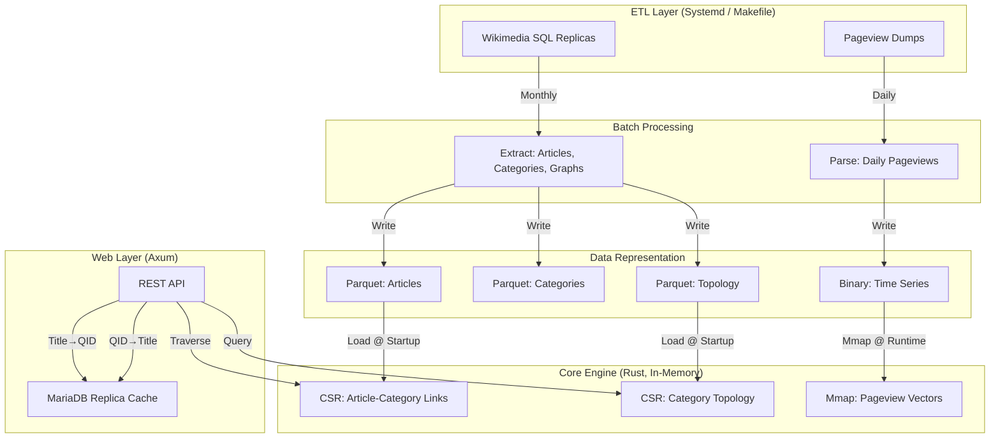

# TopicTrends: High-Performance Cross-Lingual Wikipedia Topic Analytics Engine

**Architecture Design Document**

## 1. Executive Summary

TopicTrends is a specialized analytics engine designed to ingest, model, and analyze Wikipedia pageview data across 345+ language editions while maintaining sub-millisecond query latency on commodity hardware. Rather than treating the system as a general-purpose database, the architecture embraces Data-Oriented Design principles in Rust to achieve performance and scalability that would be prohibitive in traditional database systems.

The core innovation is using Wikidata QIDs as a universal numeric currency. This architectural decision decouples the analytics engine from language-specific titles, enabling cross-lingual topic analysis while keeping the system within strict performance budgets (< 1 second response time for web-facing dashboards). The result is a system that can process global knowledge graphs with 196 million edges and deliver real-time insights across 345 Wikipedia languages simultaneously.

See the live deployment at https://topictrends.wmcloud.org/

## 2. The Problem Domain

### 2.1 Multi-Wiki Scale

The Wikipedia corpus spans 345 active language editions, each with its own topology. English Wikipedia alone contains approximately 7 million articles organized into 2.5 million categories with 196 million article-category relationships. The category graph is not a strict hierarchy—it is a directed acyclic graph with cycles, where categories can be grouped under multiple parent categories.

Beyond the structural scale lies a temporal dimension. The system ingests daily pageview data for all 345 wikis, processing millions of traffic records daily. These must be aggregated, normalized, and made queryable within a tight operational window (10 minutes for daily ingestion, 1 hour for monthly topology refreshes).

### 2.2 The Normalization Challenge

A fundamental problem arises from linguistic diversity. The concept of "physics" exists across all 345 wikis, but with different titles: "Physics" (English), "Physique" (French), "Physik" (German), "Física" (Spanish), "物理" (Japanese). Traditional approaches treat these as separate entities, losing the opportunity for cross-lingual analysis.

Performing analytics separately per language is wasteful. Knowing that topic X is trending in German Wikipedia and topic Y is trending in English Wikipedia separately is less valuable than recognizing that they represent the same global concept trending across multiple languages simultaneously.

### 2.3 Why Traditional Approaches Fail

General-purpose databases (PostgreSQL, MongoDB) excel at flexibility but sacrifice performance when dealing with global graphs. A naive query asking "what are the trending topics in all categories under Physics?" would require traversing a 20-level-deep tree across multiple tables, with cost proportional to the number of nested queries.

Graph databases (Neo4j, TigerGraph) are theoretically appealing but introduce network overhead and garbage collection pauses. An embedded graph library would require careful memory management without the performance of custom numeric operations.

Traditional search engines struggle with semantic understanding. Keyword-based searches cannot find "neural networks" when searching for "machine learning," despite their conceptual relationship.

The solution requires architectural principles rather than framework selection.

## 3. Core Architectural Principles

### 3.1 QID-Centric Numerics

TopicTrends enforces a strict "no strings in the core engine" principle. The system operates exclusively on Wikidata QIDs—universal, language-agnostic identifiers representing concepts across Wikipedia. The 'Q' prefix is stripped; QIDs are stored as native `u32` integers (e.g., `Q42` becomes `42`).

This architectural choice has profound implications. First, `u32` operations are atomic, cache-friendly, and SIMD-compatible. Comparing strings or parsing titles is eliminated from the hot path. Second, QIDs provide stability—the same identifier represents the same concept across all 345 languages, past, present, and future. An article about "Douglas Adams" is `Q42` in every Wikipedia.

The boundary between strings and numbers is pushed to the system's edge. The Axum web layer translates incoming titles to QIDs via database lookup and translates outgoing QIDs back to titles. The core engine never sees strings.

### 3.2 Data-Oriented Design Over Object Abstraction

Rather than modeling entities as objects with methods and properties, TopicTrends represents the world as flat, contiguous arrays of numbers. A category is not an object; it is an index into vectors. The article-category relationship is not an edge object; it is a position in a Compressed Sparse Row matrix.

This design principle maximizes memory locality. Modern CPUs achieve peak performance when data fits in cache and is accessed sequentially. Arrays of numbers are prefetched efficiently. Pointer-chasing through object graphs causes cache misses.

### 3.3 Edge-Layer Separation

String handling, title resolution, and human-readable output are pushed to the edge—the Axum web server. This separation serves two purposes. First, it preserves the core engine's purity; algorithms operate on integers, not strings. Second, it enables independent optimization. The web layer can be replicated, cached, or replaced without affecting core logic.

### 3.4 Memory Locality Optimization

Every architectural decision is evaluated by its impact on memory access patterns. Nested data structures are flattened. Heap allocations are minimized. Iteration order matches layout in memory. This discipline yields 20ms query latencies where generic solutions would require seconds.

## 4. System Data Flow

The system divides into four layers, each with distinct responsibilities and optimization axes.

## 5. Data Representation & Algorithms

### 5.1 Compressed Sparse Row for Massive Graphs

English Wikipedia has 196 million article-category relationships. A naive representation using nested vectors (`Vec<Vec<u32>>`) would incur 24 bytes of overhead per article for vector metadata, totaling 168 MB just in headers. With heap fragmentation, this quickly becomes prohibitive.

TopicTrends uses Compressed Sparse Row (CSR) representation—a classical sparse matrix format. The structure requires two arrays: `offsets` (one entry per article) and `targets` (one entry per relationship). For English Wikipedia, this totals approximately 28 MB for offsets and 784 MB for targets, consuming under 1 GB RAM total. More importantly, both arrays are contiguous in memory, enabling prefetching and cache efficiency that generic data structures cannot match.

The tradeoff is flexibility. CSR representations are immutable once constructed; dynamic insertion requires reconstruction. This constraint maps perfectly to TopicTrends' batch-oriented update model—topology is refreshed monthly as a complete operation, not incrementally.

### 5.2 Memory-Mapped Time Series

Pageview data arrives daily for 345 wikis in compressed format. Rather than decompressing into memory, TopicTrends streams the data directly to binary files on disk. These files are then memory-mapped into the process address space.

This design exploits the operating system's virtual memory system. For a year of daily data, the resulting files span several gigabytes. The OS automatically pages hot data (recent days) into RAM while keeping cold data on disk. The application accesses data through a uniform mmap interface without explicitly managing which pages reside where. This is more elegant and efficient than application-level caching strategies.

### 5.3 Recursive Aggregation with Cycle Handling

Computing the total pageviews for a category including all its subcategories requires traversing a potentially 20-level-deep tree. The category graph contains cycles—a category can appear under multiple parents, and those parents might eventually reference the original category indirectly. Naive recursion would infinite-loop; a naive visited-set would over-count.

The solution is level-wise propagation. The graph depth is analyzed once during startup. At query time, scores from leaf categories (depth N) are propagated upward to parents (depth N-1), then to their parents (depth N-2), and so forth. This avoids the infinite loop problem because the propagation always moves toward the root. Cycles are handled by tracking visited nodes during the traversal, ensuring each category contributes its value exactly once.

This approach achieves $O(E)$ complexity, where $E$ is the number of edges (196 million for English Wikipedia). The entire aggregation for a category tree completes in approximately 20 milliseconds.

### 5.4 Trending Discovery via Reverse Scatter

Finding which categories are trending without checking all 2.5 million of them is a classic problem. The naive approach—computing all category scores and sorting—would require touching every category.

Instead, the system performs a reverse scatter operation. Rather than pushing from categories to articles, it starts from articles (which contain pageview data) and scatters values to their parent categories via the CSR adjacency. Because only articles with non-zero pageview data participate, the algorithm's cost is proportional to article traffic, not category count. For typical Wikipedia traffic, this operation completes in milliseconds.

## 6. Semantic Topic Search: Architecture & Tradeoffs

### 6.1 The Motivation: Concept Over Keywords

Traditional keyword-based search assumes exact phrase matching. Searching for "machine learning" returns only categories with those exact words, missing "neural networks," "deep learning," and "artificial intelligence"—concepts that are semantically synonymous.

Semantic search uses neural embeddings—dense vector representations of text where similarity in vector space correlates with semantic similarity. A query and a candidate category are both converted to high-dimensional vectors, and cosine distance measures semantic relatedness. This enables discovering "neural networks" when searching for "machine learning."

### 6.2 Architecture Decision: English-Only Embeddings

A straightforward approach would embed category titles in all 345 languages using a multilingual model. This would require 345 separate vector collections, each with 2.5 million embeddings. Storage would reach 3.3 terabytes.

TopicTrends employs an elegant alternative: a single English embedding model for all languages. English Wikipedia has the largest, most-linked knowledge graph in Wikidata. A high-quality English embedding model provides superior semantic understanding compared to spreading effort across marginal languages.

The cross-lingual capability is preserved through QID translation. When a user queries in French for AI-related topics, the system encodes the English translation of their query using the English model, searches a single English vector collection, then translates results back to French via Wikidata QID mapping. The semantic understanding comes from English's linguistic richness; the cross-lingual coverage comes from QID universality.

This reduces storage by a factor of 348 (from 3.3 TB to 9.6 GB) while introducing a single constraint: queries must be formulated in English. Results can be returned in any language.

### 6.3 Vector Database & Indexing

Searching 2.5 million embeddings requires indexing. A linear scan would check every category—prohibitive for real-time use. TopicTrends stores embeddings in Qdrant, which implements Hierarchical Navigable Small World (HNSW) indexing. This approximate nearest-neighbor algorithm achieves $O(\log N)$ query complexity while returning the true top-k results with high probability.

The embeddings are 384-dimensional vectors (chosen for the balance between expressiveness and computational cost). Distance is measured via cosine similarity, which is invariant to vector magnitude—two documents saying the same thing with different verbosity have the same embedding. The index uses on-disk vector storage with quantized data in RAM, balancing memory efficiency with search speed.

### 6.4 Query Flow & Cross-Lingual Translation

When a query arrives with a target Wikipedia language, the system follows a deterministic flow. First, the English query is encoded to a 384-dimensional vector using the fixed English model. Second, the vector is searched against the `enwiki-categories` collection in Qdrant, returning the top-k results with similarity scores. Third, if the target language is not English, the system performs QID lookup in the target Wikipedia to translate category titles. Categories that do not exist in the target Wikipedia are filtered out.

This architecture achieves true cross-lingual search with minimal infrastructure. The semantic understanding is bottlenecked by English embeddings, but the coverage spans all 345 languages through QID universality.

## 7. Cross-Lingual Unification

### 7.1 QID as Universal Identifier

Wikidata assigns a unique, immutable identifier to every concept in human knowledge. The identifier `Q11019` represents "artificial intelligence" in all 345 Wikipedia languages, in all time periods. In English Wikipedia, it maps to the title "Artificial intelligence." In French Wikipedia, `Q11019` maps to "Intelligence artificielle." In German, "Künstliche Intelligenz."

This design choice is profound. Most systems treat language editions as siloed—French Wikipedia is separate from English Wikipedia is separate from German Wikipedia. Trends are computed independently per language.

With QID unification, the system can correlate trends across languages. If a topic's QID is accumulating pageviews in French, German, Spanish, and Japanese simultaneously, that is a global trend independent of which language "discovered" it first.

### 7.2 Current Capabilities

Today, TopicTrends analyzes each Wikipedia independently and uses QIDs to enable semantic search across languages. The architecture supports this seamlessly—queries are always in English, but results appear in any target language.

### 7.3 Future Possibilities

The architecture supports aggregating pageview vectors across languages: `GlobalViews(Q42) = EnglishViews(Q42) + FrenchViews(Q42) + GermanViews(Q42) + ...` This would reveal which topics are genuinely globally viral versus locally popular in one language edition. This capability requires no architectural changes—only the aggregation logic.

## 8. Graph Topology & Cycle Handling

The category graph is a directed acyclic graph (DAG) with cycles. Categories can have multiple parents, and cyclical references are possible. When traversing the graph for aggregation, infinite loops must be avoided while ensuring each category contributes to parent counts exactly once.

The solution employs visited-set tracking. During level-wise propagation, a set tracks which categories have already contributed their scores at the current depth level. When encountering a category already in the visited set, its contribution is skipped, preventing double-counting and infinite loops. This maintains correctness while preserving the $O(E)$ traversal complexity.

## 9. Performance Characteristics & Scaling

TopicTrends is proven to scale across the full Wikipedia corpus (345 languages, 196 million edges) on commodity hardware. The following performance characteristics are observed in production.

The recursive aggregation algorithm completes in under 20 milliseconds for any category tree, bounded by $O(E)$ where $E$ is the number of edges. The trending discovery reverse scatter is sublinear in category count, proportional only to articles with nonzero traffic.

Semantic search latency is dominated by vector encoding (embedding service) and Qdrant nearest-neighbor search. For a typical query, encoding takes 10-50 milliseconds, search takes 5-20 milliseconds, and cross-lingual QID translation adds 5-15 milliseconds, totaling under 100 milliseconds for most queries.

The architecture scales with the number of categories (currently 2.5 million for English), not exponentially with languages. Adding a new Wikipedia edition requires ingesting its topology and pageviews, but does not increase the semantic search footprint—the English embeddings remain constant.

## 10. Design Decisions & Fundamental Tradeoffs

### 10.1 Why Rust

Performance-critical systems typically require low-level languages. Rust provides memory safety without garbage collection pauses, enabling deterministic latency. SIMD operations are accessible through libraries. The type system catches entire classes of concurrency bugs at compile time. For a system where 20 milliseconds is the performance target, these properties are essential.

### 10.2 Why CSR Over Alternatives

Graph databases like Neo4j provide query convenience at the cost of runtime overhead. Edge lists require pointer-chasing through memory. Adjacency matrices waste space for sparse graphs. CSR is the classical approach for exactly this problem: large sparse graphs with static structure and frequent traversals. The tradeoff is immutability—dynamic insertion requires reconstruction—but this matches TopicTrends' batch-update model.

### 10.3 Why Memory-Mapped Files

Keeping gigabytes of time series in RAM wastes memory for cold data. Keeping data entirely on disk incurs I/O latency. Memory-mapped files let the OS manage the boundary automatically. Modern operating systems handle this efficiently; attempting to compete with the kernel's page cache management through application-level caching is futile. The application gains simplicity and the OS gains visibility into access patterns.

### 10.4 Why Single Embedding Model

A tempting alternative is using multilingual sentence transformers to embed all 345 languages. This incurs 348x storage cost and requires maintaining and optimizing models for marginal languages. The single-English approach leverages the fact that Wikidata provides a "Rosetta Stone"—universal identifiers that map across all languages. English as the semantic bottleneck is a reasonable tradeoff given its linguistic richness.

### 10.5 Why Qdrant for Vector Search

Vector search requires approximate nearest-neighbor indexing. Alternatives include FAISS (library), Milvus (system), and cloud solutions like Pinecone. FAISS requires lower-level integration; Milvus requires operational overhead; cloud solutions introduce vendor lock-in. Qdrant provides a standalone service with straightforward REST/gRPC interfaces, persistent storage, and the HNSW algorithm proven in production systems.

### 10.6 What Was Sacrificed

The architecture prioritizes read latency over write flexibility. Topology cannot be updated incrementally—monthly refreshes require full reconstruction. Queries are in English (though results appear in any language). Dynamic graph modifications require taking the system offline. These sacrifices are intentional, not oversights. The use case (analytics on static Wikipedia topology) makes them acceptable.

## 11. Known Limitations & Future Work

### 11.1 Static Topology Refresh

The system refreshes its category topology monthly. Between refreshes, new Wikipedia articles and categories are not reflected in analytics. For many use cases this is acceptable; Wikipedia's topology changes slowly. For real-time trend analysis of breaking news, this is a limitation worth noting.

### 11.2 English Query Requirement

Semantic search requires English-language queries. The embedding model understands English semantics; queries in other languages are not translated or understood natively. This is a deliberate design choice; supporting multiple query languages would require either multilingual models (storage explosion) or machine translation (latency and error introduction).

### 11.3 Incomplete Cross-Wikipedia Aggregation

Today, trending analysis occurs within each Wikipedia independently. The architecture supports global aggregation across QID boundaries (identifying trends that span multiple languages) but this is not yet implemented in the query layer. This is a natural extension, not an architectural limitation.

## 12. Testing Philosophy & Development

TopicTrends follows Unix philosophy: small, focused packages with single responsibilities, each with comprehensive internal testing, later integrated into the full system.

The `topictrend_core` crate contains the pure numeric algorithms—CSR traversal, level-wise aggregation, visited-set cycle handling. These are tested in isolation with synthetic graphs of varying size and structure. The `topictrend_taxonomy` crate handles semantic search integration; it is tested against the live embedding service and Qdrant instance. The `topictrend_web` crate handles HTTP routing and title-to-QID translation; it is tested against the real MariaDB replica.

This separation enables rapid iteration. Algorithmic improvements to `topictrend_core` can be validated without involving external services. Semantic search changes can be tested independently of web routing.

## 13. Development & Operations

For operational details, data ingestion procedures, deployment instructions, and configuration, see [OPERATIONS.md](OPERATIONS.md).

For REST API documentation, endpoint specifications, and usage examples, see [API.md](API.md).

---

## Summary

TopicTrends demonstrates that by abandoning standard database abstractions in favor of data-oriented design, numeric-first principles, and careful architectural separation, it is possible to process global knowledge graphs on commodity hardware with sub-second latency and sub-millisecond aggregations. The system compresses the complexity of 345 Wikipedias into efficient integer arrays and vector indices, delivering capabilities that were previously computationally prohibitive.
