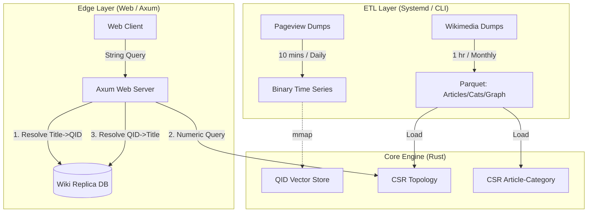

# TopicTrends: High-Performance Cross-Lingual Wikipedia Topic Analytics Engine

**Architecture Design Document**

## 1. Executive Summary
**TopicTrends** is a specialized high-performance analytics engine designed to ingest, model, and query Wikipedia pageview data across **345+ language editions**. Unlike general-purpose databases, TopicTrend utilizes **Data-Oriented Design (DOD)** principles in Rust to achieve sub-millisecond graph traversals and real-time trend analysis.

A key architectural distinction is the system's reliance on **Wikidata QIDs** as the internal numeric currency. This decouples the analytics engine from language-specific titles, paving the way for cross-lingual topic analysis while maintaining a strict low-latency budget (< 1s) for web-facing dashboards.

URL: https://topictrends.wmcloud.org/

## 2. Problem Modeling & Scale

### 2.1 The Data Domain (English Wikipedia Baseline)
*   **Articles:** ~7 Million.
*   **Categories:** ~2.5 Million.
*   **Graph Density:** A massive **196 Million** Article $\to$ Category relationships.
*   **Topology:** The category graph is a **Directed Cyclic Graph** (DAG with cycles), not a strict tree.
*   **Metrics:** Time-series pageview data processed daily.

### 2.2 The Multi-Wiki Challenge
*   **Scope:** 345 active Wikipedia language editions.
*   **Throughput:** The system must ingest daily traffic logs for all wikis within a tight operational window.
*   **Normalization:** Titles vary by language ("Physics", "Physique", "Physik"), but the concept is universal.

### 2.3 The Solution: QID-Centric Numerics
To solve the normalization and performance problem simultaneously, TopicTrend enforces a strict **"No Strings"** policy within the core engine.
*   **Universal ID:** We utilize the Wikidata QID (e.g., `Q42`).
*   **Numeric Storage:** The 'Q' is stripped, storing the ID as a native `u32` (e.g., `42`).
*   **Rationale:** `u32` operations are atomic and SIMD-friendly. QIDs provide a stable, language-agnostic reference, enabling future features where trends in the English "Physics" category can be correlated with the German "Physik" category automatically.

---

## 3. System Architecture

### 3.1 High-Level Data Flow

### 3.2 Key Architectural Decisions

#### A. QID as the Numeric Atom
The core engine knows nothing of strings. It operates exclusively on `u32` QIDs.
*   **Storage:** `Vec<u32>` and `CsrAdjacency`.
*   **Translation Layer:** The translation from "User Readable Title" to "System QID" is pushed to the **Edge Layer**. The Web Server performs a fast lookup against a local Wikipedia Database Replica (MariaDB/MySQL) only when resolving input/output.
*   **Benefit:** The core analytics engine is pure math, unencumbered by string encoding, localization, or storage overhead.

#### B. Compressed Sparse Row (CSR) for Massive Density
English Wikipedia has **196 Million** article-category links.
*   **Naive Approach:** `Vec<Vec<u32>>` would incur a 24-byte header overhead per article, plus heap fragmentation.
*   **TopicTrend Approach:** A flattened CSR structure.
    *   `offsets`: ~7M entries (28MB).
    *   `targets`: 196M entries (784MB).
*   **Impact:** The entire mapping fits in **< 1GB RAM** with perfect cache locality. This allows the "Scatter" phase of trend analysis to saturate memory bandwidth.

#### C. Memory-Mapped Time Series
*   **Throughput:** The system processes daily pageviews for **345 wikis in 10 minutes**.
*   **Format:** Per-day, per-wiki binary files.
*   **Mechanism:** `bzip2` stream $\to$ Rust Parser $\to$ Binary Write.
*   **Access:** The web server `mmap`s these files. For a year of data, the OS handles paging, keeping the "hot" recent days in RAM while cold storage sits on disk.

---

## 4. Operational Pipeline & Performance

The system is orchestrated via `systemd` timers and a highly optimized `Makefile`.

### 4.1 Daily Ingestion (The 10-Minute Job)
*   **Task:** Download compressed pageview logs, parse lines, map titles to QIDs, sum views, and write binary vectors for 345 wikis.
*   **Performance:** ~10 Minutes total.
*   **Efficiency:** Uses streaming I/O to ensure RAM usage remains constant regardless of dump size.

### 4.2 Bootstrap / Refresh (The 1-Hour Job)
*   **Task:** Fetch all Articles, Categories, Graphs, and Mappings for 345 wikis.
*   **Source:** Wikimedia SQL Replicas.
*   **Frequency:** Weekly or Monthly (Topology changes slowly).
*   **Performance:** ~1 Hour total.
*   **Output:** Highly compressed Parquet files used to hydrate the in-memory graph on server restart.

---

## 5. Web Interface & API Layer

The web layer is built on **Axum** (Rust), designed to be a thin wrapper around the core engine. All endpoints operate with a strict **< 1 Second** latency budget.

### 5.1 API Endpoints

| Endpoint | Description | Implementation |
| :--- | :--- | :--- |
| `GET /api/pageviews/category` | Recursive pageviews for a category tree. | Uses **Reverse Depth Propagation** ($O(E)$). |
| `GET /api/pageviews/article` | Raw daily views for a specific QID. | Direct `mmap` array slice access ($O(1)$). |
| `GET /api/list/sub_categories` | Navigation helper. | CSR Adjacency lookup ($O(1)$). |
| `GET /api/list/top_categories` | Finds trending topics within a time range. | **Reverse Scatter** algorithm ($O(N_{articles})$). |

### 5.2 The Resolution Strategy
1.  **Request:** User asks for "Physics".
2.  **Lookup:** Axum queries local DB: `SELECT qid FROM page WHERE title = 'Physics'`. Result: `42`.
3.  **Process:** Core engine runs algorithms on `42`. Result: Top child is `99` with 1M views.
4.  **Resolve:** Axum queries local DB: `SELECT title FROM page WHERE qid = 99`. Result: "Quantum Mechanics".
5.  **Response:** JSON `{ "category": "Quantum Mechanics", "views": 1000000 }`.

---

## 6. Algorithms & Complexity Analysis

### 6.1 Recursive Aggregation (Level-Wise Propagation)
To aggregate views for a category and all its 20 levels of subcategories (without double-counting or infinite loops):
1.  **Pre-computation:** The graph depth is analyzed once. (English Wiki Max Depth $\approx$ 19).
2.  **Runtime:** We iterate depths from $19 \to 1$. Scores from depth $N$ are added to parents at $N-1$.
3.  **Complexity:** $O(E)$ (Linear to the number of edges).
4.  **Speed:** ~20ms for the entire graph.

### 6.2 Trending Category Discovery
To find which categories are trending without checking all 2.5 million of them:
1.  **Scatter:** We iterate the *Articles* (which contain the view data).
2.  **Accumulate:** For each article with views, we push the score to its parent categories via the CSR link.
3.  **Lazy Resolution:** We only resolve QIDs to Titles for the final "Top 20" list.

---

## 7. Future Scope: Cross-Lingual Analysis

The decision to use **QIDs** as the primary key is strategic.
*   **Current State:** Isolated analysis of English, German, French, etc.
*   **Future State:**
    *   Since `Q42` represents "Douglas Adams" in *all* 345 wikis:
    *   We can sum vectors across languages: `Global_Views(Q42) = En_Views(Q42) + De_Views(Q42) + ...`
    *   **Result:** A global "Topic Trend" dashboard that identifies viral topics regardless of the language they originated in.

---

## 8. Conclusion

TopicTrends demonstrates that by abandoning standard database abstractions in favor of **Data-Oriented Design**, **QID-centric normalization**, and **CSR topology**, it is possible to process global-scale knowledge graphs on commodity hardware. The system effectively compresses the complexity of 345 Wikipedias into a set of efficient integer arrays, delivering real-time insights that were previously computationally prohibitive.
