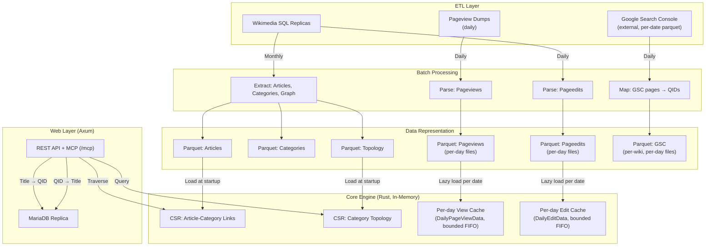

# TopicTrends

TopicTrends is an analytics engine for Wikipedia topic trends across 345+ language editions. It ingests pageview, pageedit, and Google Search Console data, models the Wikipedia category graph in memory as Compressed Sparse Row (CSR) matrices, and serves sub-second analytics from an Axum HTTP server on commodity hardware.

Live deployment: https://topictrends.wmcloud.org/

This README orients maintainers. For the reasoning behind the design choices, see [DESIGN.md](DESIGN.md); for the data structures and algorithms, see [ARCHITECTURE.md](ARCHITECTURE.md).

## Capabilities

- **Pageview trends** — category-, article-, and topic-level view trends at daily granularity, across all wikis
- **Pageedit analytics** — edit-activity trends per category or article
- **Google Search Console analytics** — clicks, impressions, CTR, and position per article, keyed by QID
- **Top-N rankings** — trending categories and articles by views, edits, or search, over any date range
- **Delta analysis** — compare two time periods to surface categories or articles with significant change
- **Content-gap analysis** — cross-wiki coverage comparison: topics present in one language but absent in another
- **Semantic category search** — an English query returns semantically related categories in any target language, via neural embeddings

Every operation is exposed twice: as a REST endpoint under `/api/` and as a Model Context Protocol (MCP) tool at `/mcp`. See [API.md](API.md).

## Quick start

```bash
cargo build --release        # all binaries land in target/release/
cargo test                   # all crates
make web                     # run the server on :8765 (needs .env with DB_USERNAME / DB_PASSWORD)
```

`make web` runs the server directly; semantic search runs in-process, so no extra service is needed. The full ETL pipeline (SQL replicas, pageview dumps) runs only on a Wikimedia Cloud VPS — see [OPERATIONS.md](OPERATIONS.md). Semantic-search indexing is covered in [SEMANTIC_SEARCH.md](SEMANTIC_SEARCH.md).

## Crates

| Crate | Responsibility |
|---|---|
| `topictrend_core` (lib `topictrend`) | Pure numeric engine — CSR adjacency, `WikiGraph`, the `PageViewEngine` / `PageEditsEngine` / `GoogleSearchEngine`, and per-day Parquet readers/writers. No strings, no HTTP, no DB; operates entirely on `u32` QIDs. |
| `topictrend_cli` | ETL binaries (`get-articles`, `get-categories`, `get-categorygraph`, `get-article_category`, `get-pageviews`, `get-per_day_wiki_stats`, `get-day-pageedits`, `get-gsc-qid-date`) plus the `wikigraph` query CLI. Driven by the Makefile pipeline. |
| `topictrend_web` | Axum HTTP server + MCP server. `routes.rs` → `handlers/` (title↔QID translation) → `services/core/` (single engine) or `services/composite/` (multiple engines). Tera templates, static assets. |
| `topictrend_taxonomy` | In-process semantic search: query encoding via `fastembed` (ONNX `all-MiniLM-L12-v2`) and vector search via the `zvec` Rust SDK over the on-disk category embeddings. |

## Mental model

These invariants hold across the codebase; breaking one invalidates assumptions elsewhere.

- **No strings in the core engine.** Everything inside `topictrend_core` is a `u32` QID (the Wikidata id with the `Q` prefix stripped). Title↔QID translation happens only in `topictrend_web` via MariaDB. See [ARCHITECTURE.md](ARCHITECTURE.md#qid-centric-numerics).
- **Two ID spaces.** External QID (`Q42` → `42`) versus internal dense ID (a `0..N` array index). CSR adjacency and `RoaringBitmap` sets always use dense IDs; results translate back to QIDs at the API boundary.
- **One `WikiGraph` per wiki, shared and immutable.** Built once per wiki and shared as `Arc<WikiGraph>` across the three metric engines — no lock needed. See [ARCHITECTURE.md](ARCHITECTURE.md#one-wikigraph-per-wiki-shared-across-metric-engines).
- **Per-day Parquet, densified on load.** Time series are small sparse per-day Parquet files keyed by the stable QID (so they survive topology rebuilds), loaded on first access into a bounded FIFO cache (`TOPICTREND_PAGEVIEW_CACHE_DAYS` / `TOPICTREND_PAGEEDIT_CACHE_DAYS`, default 120). Lookup is `O(log n)` binary search. See [ARCHITECTURE.md](ARCHITECTURE.md#per-day-pageview-parquet-densified-on-load).
- **Trending = reverse scatter.** Iterate only articles with non-zero data and scatter into parent categories via CSR — cost is proportional to traffic, not category count. See [ARCHITECTURE.md](ARCHITECTURE.md#trending-discovery-via-reverse-scatter).

## Adding a web endpoint

1. Add request/response DTOs to `topictrend_web/src/models.rs`.
2. Implement the logic in `services/core/` (single engine) or `services/composite/` (multiple engines, e.g. delta).
3. Add the handler in `handlers/` — translate titles→QIDs, call the service, then translate QIDs→titles for the response.
4. Wire the route in `routes.rs`.
5. To expose it over MCP, add a corresponding tool in `mcp/tools/`.
6. Update `openapi.yaml` (served at `/openapi.yaml`, rendered at `/docs`).

## System overview


```mermaid
graph TD
    subgraph "ETL Layer"
        SQL["Wikimedia SQL Replicas"]
        PV_DUMPS["Pageview Dumps\n(daily)"]
        GSC_DUMPS["Google Search Console\n(external, per-date parquet)"]
    end

    subgraph "Batch Processing"
        META["Extract: Articles, Categories, Graph"]
        PV_PROC["Parse: Pageviews"]
        PE_PROC["Parse: Pageedits"]
        GSC_PROC["Map: GSC pages → QIDs"]
    end

    subgraph "Data Representation"
        PQ_ART["Parquet: Articles"]
        PQ_CAT["Parquet: Categories"]
        PQ_GRAPH["Parquet: Topology"]
        PQ_PV["Parquet: Pageviews\n(per-day files)"]
        PQ_PE["Parquet: Pageedits\n(per-day files)"]
        PQ_GSC["Parquet: GSC\n(per-wiki, per-day files)"]
    end

    subgraph "Core Engine (Rust, In-Memory)"
        CSR_LINK["CSR: Article-Category Links"]
        CSR_TOPO["CSR: Category Topology"]
        DENSE_PV["Per-day View Cache\n(DailyPageViewData, bounded FIFO)"]
        SPARSE_PE["Per-day Edit Cache\n(DailyEditData, bounded FIFO)"]
    end

    subgraph "Web Layer (Axum)"
        API["REST API + MCP (/mcp)"]
        DB_REP["MariaDB Replica"]
    end

    SQL -->|Monthly| META
    SQL -->|Daily| PE_PROC
    PV_DUMPS -->|Daily| PV_PROC
    GSC_DUMPS -->|Daily| GSC_PROC

    META --> PQ_ART
    META --> PQ_CAT
    META --> PQ_GRAPH
    PV_PROC --> PQ_PV
    PE_PROC --> PQ_PE
    GSC_PROC --> PQ_GSC

    PQ_ART -->|Load at startup| CSR_LINK
    PQ_GRAPH -->|Load at startup| CSR_TOPO
    PQ_PV -->|Lazy load per date| DENSE_PV
    PQ_PE -->|Lazy load per date| SPARSE_PE

    API -->|Title → QID| DB_REP
    API -->|Query| CSR_TOPO
    API -->|Traverse| CSR_LINK
    API -->|QID → Title| DB_REP
```

The system divides into four layers: ETL (data ingestion), batch processing (parsing and storage), core engine (in-memory numeric computation), and web layer (title translation and HTTP/MCP routing).

Pageviews, pageedits, and GSC use the same in-memory shape, differing only in load timing and columns. Each is written as a per-day Parquet file keyed by Wikidata QID — sparse, sorted, and refresh-stable across topology rebuilds. On first access for a given date the engine decompresses the file, translates QIDs to current dense article IDs, and caches a parallel-array structure (sorted dense IDs plus values) over only the articles with data that day, giving `O(log n)` lookup and zero-skipping aggregation. The cache is bounded per wiki (default 120 days, configurable) with FIFO eviction.

Google Search Console data arrives as an external source: Hive-partitioned parquets (`data/gsc_page_date/date=YYYY-MM-DD/data.parquet`). The `get-gsc-qid-date` binary maps page URLs to QIDs via `articles.parquet` and writes per-wiki, per-day parquets with schema `(qid, clicks, impressions, ctr, position)` — no URLs or titles retained.

## Documentation

| Document | Contents |
|---|---|
| [ARCHITECTURE.md](ARCHITECTURE.md) | Core principles, CSR graphs, per-day Parquet time series, aggregation algorithms, cross-lingual unification |
| [SEMANTIC_SEARCH.md](SEMANTIC_SEARCH.md) | Embedding architecture, HNSW indexing, cross-lingual query flow |
| [DESIGN.md](DESIGN.md) | Design decisions, tradeoffs, and known limitations |
| [API.md](API.md) | REST API endpoints, parameters, and response formats |
| [OPERATIONS.md](OPERATIONS.md) | Deployment, configuration, data ingestion, and troubleshooting |
