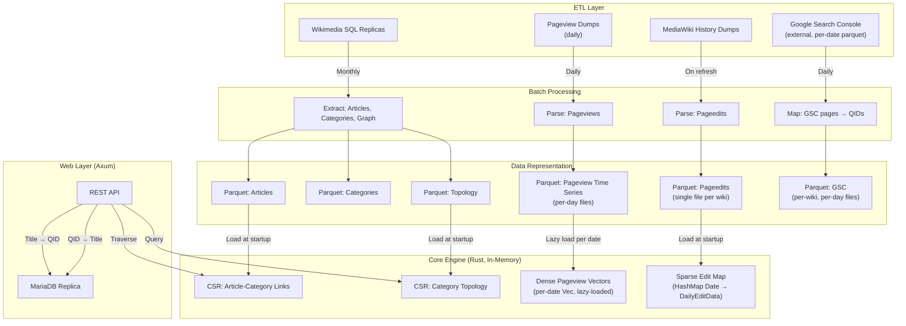

# TopicTrends

TopicTrends is an analytics engine for Wikipedia topic trends across 345+ language editions. It ingests pageview and pageedit data, models the Wikipedia category graph, and delivers sub-second analytics on commodity hardware using Rust and data-oriented design.

Live deployment: https://topictrends.wmcloud.org/

## The Problem

### Multi-Wiki Scale

The Wikipedia corpus spans 345 active language editions, each with its own topology. English Wikipedia alone contains approximately 7 million articles organized into 2.5 million categories with 196 million article-category relationships. The category graph is not a strict hierarchy — it is a directed graph with cycles, where categories can be grouped under multiple parent categories.

Beyond structural scale lies a temporal dimension. The system ingests daily pageview data and periodic pageedit history for all 345 wikis, processing millions of records. These must be aggregated, normalized, and made queryable within a tight operational window (10 minutes for daily pageview ingestion, 1 hour for monthly topology refreshes).

### The Normalization Challenge

A fundamental problem arises from linguistic diversity. The concept of "physics" exists across all 345 wikis, but with different titles: "Physics" (English), "Physique" (French), "Physik" (German), "Física" (Spanish), "物理学" (Japanese). Traditional approaches treat these as separate entities, losing the opportunity for cross-lingual analysis.

Performing analytics separately per language is wasteful. Knowing that topic X is trending in German Wikipedia and topic Y is trending in English Wikipedia separately is less valuable than recognizing that they represent the same global concept trending across multiple languages simultaneously.

### Why Traditional Approaches Fall Short

General-purpose databases (PostgreSQL, MongoDB) excel at flexibility but struggle when dealing with global graphs. A query asking "what are the trending topics in all categories under Physics?" requires traversing a 20-level-deep tree with cost proportional to the number of nested queries.

Graph databases (Neo4j, TigerGraph) are theoretically appealing but introduce network overhead and garbage collection pauses. Traditional search engines cannot find "neural networks" when searching for "machine learning" — they match keywords, not concepts.

The solution requires architectural principles rather than framework selection.

## Features

- **Pageview trend analytics** — category and article level pageview trends across all 345 Wikipedia editions, with daily granularity
- **Page edit analytics** — edit activity trends and delta analysis per category or article, across all wikis
- **Google Search Console analytics** — search clicks, impressions, CTR and position trends per article, keyed by QID, sourced from Google Search Console data
- **Content gap analysis** — cross-wiki article coverage comparison to identify topics present in one language but absent in another
- **Semantic category search** — English query returns semantically related categories in any target language, powered by neural embeddings
- **Delta analysis** — compare any two time periods to identify categories or articles with significant changes in views or edits

## System Overview

```mermaid
graph TD
    subgraph "ETL Layer"
        SQL["Wikimedia SQL Replicas"]
        PV_DUMPS["Pageview Dumps\n(daily)"]
        PE_DUMPS["MediaWiki History Dumps"]
        GSC_DUMPS["Google Search Console\n(external, per-date parquet)"]
    end

    subgraph "Batch Processing"
        META["Extract: Articles, Categories, Graph"]
        PV_PROC["Parse: Pageviews"]
        PE_PROC["Parse: Pageedits"]
        GSC_PROC["Map: GSC pages → QIDs"]
    end

    subgraph "Data Representation"
        PQ_ART["Parquet: Articles"]
        PQ_CAT["Parquet: Categories"]
        PQ_GRAPH["Parquet: Topology"]
        PQ_PV["Parquet: Pageview Time Series\n(per-day files)"]
        PQ_PE["Parquet: Pageedits\n(single file per wiki)"]
        PQ_GSC["Parquet: GSC\n(per-wiki, per-day files)"]
    end

    subgraph "Core Engine (Rust, In-Memory)"
        CSR_LINK["CSR: Article-Category Links"]
        CSR_TOPO["CSR: Category Topology"]
        DENSE_PV["Dense Pageview Vectors\n(per-date Vec<u32>, lazy-loaded)"]
        SPARSE_PE["Sparse Edit Map\n(HashMap Date → DailyEditData)"]
    end

    subgraph "Web Layer (Axum)"
        API["REST API"]
        DB_REP["MariaDB Replica"]
    end

    SQL -->|Monthly| META
    PV_DUMPS -->|Daily| PV_PROC
    PE_DUMPS -->|On refresh| PE_PROC
    GSC_DUMPS -->|Daily| GSC_PROC

    META --> PQ_ART
    META --> PQ_CAT
    META --> PQ_GRAPH
    PV_PROC --> PQ_PV
    PE_PROC --> PQ_PE
    GSC_PROC --> PQ_GSC

    PQ_ART -->|Load at startup| CSR_LINK
    PQ_GRAPH -->|Load at startup| CSR_TOPO
    PQ_PV -->|Lazy load per date| DENSE_PV
    PQ_PE -->|Load at startup| SPARSE_PE

    API -->|Title → QID| DB_REP
    API -->|Query| CSR_TOPO
    API -->|Traverse| CSR_LINK
    API -->|QID → Title| DB_REP
```

The system divides into four layers: ETL (data ingestion), batch processing (parsing and storage), core engine (in-memory numeric computation), and web layer (title translation and HTTP routing).

Pageviews and pageedits use the same in-memory shape, with different load timing. Pageviews are written as per-day Parquet files keyed by Wikidata QID — sparse, sorted, and refresh-stable across topology rebuilds. On first access for a given date the engine decompresses the file, translates QIDs to current dense article IDs, and caches a `DailyPageViewData` (two parallel sorted `Vec<u32>` arrays — dense IDs and view counts — over only the articles that had views on that date) for `O(log n)` lookup and zero-skipping aggregation. This in-memory cache is bounded (default 120 days per wiki, configurable via `TOPICTREND_PAGEVIEW_CACHE_DAYS`) and evicts oldest entries in FIFO order. Pageedits are stored in a single Parquet file per wiki and loaded at startup into the same shape (`HashMap<Date, DailyEditData>`).

Google Search Console data is an external source deposited as Hive-partitioned parquets (`data/gsc_page_date/date=YYYY-MM-DD/data.parquet`). The `get-gsc-qid-date` ETL binary maps article page URLs to QIDs via `articles.parquet` and writes per-wiki, per-day parquets to `data/<wiki>/gsc/<YEAR>/<MONTH>/<DAY>.parquet`. The output schema is `(qid, clicks, impressions, ctr, position)` — no URLs or titles retained.

## Semantic Search

TopicTrends supports semantic category search using neural embeddings. A single English embedding index covers all 345 languages via Wikidata QID translation — queries are in English, results are returned in any target language.

See [SEMANTIC_SEARCH.md](SEMANTIC_SEARCH.md) for architecture details.

## Documentation

| Document | Contents |
|---|---|
| [ARCHITECTURE.md](ARCHITECTURE.md) | Core principles, CSR graphs, memory-mapped time series, aggregation algorithms, cross-lingual unification |
| [SEMANTIC_SEARCH.md](SEMANTIC_SEARCH.md) | Embedding architecture, HNSW indexing, cross-lingual query flow |
| [DESIGN.md](DESIGN.md) | Design decisions, tradeoffs, and known limitations |
| [API.md](API.md) | REST API endpoints, parameters, and response formats |
| [OPERATIONS.md](OPERATIONS.md) | Deployment, configuration, data ingestion, and troubleshooting |
