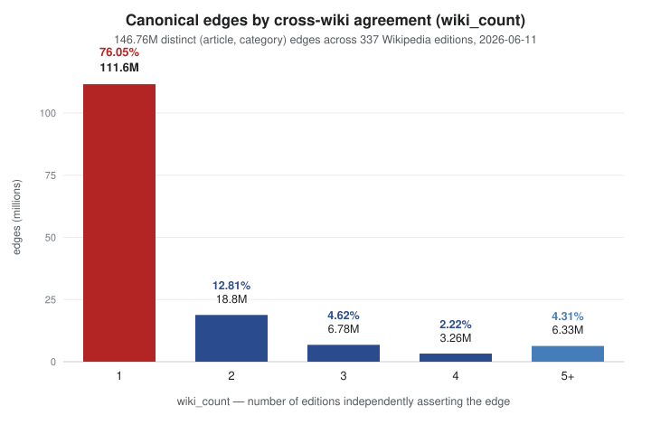

# The cross-wiki canonical category relation

A technical report on what 337 Wikipedia editions collectively know about
categorizing their articles.

Snapshot: 2026-06-11 (337 editions, `data/wikipedia.list`, cebwiki excluded).
Author: Santhosh Thottingal

> **A note on terms.** TopicTrends has two generations of category logic, and I
> contrast them throughout. **v1** discovers a category's articles by traversing
> a *single* edition's own category graph down to some depth (the engine's
> `get_articles_in_category` at depth 0/1/2). **v2** — the subject of this
> report — instead unions all 337 editions' direct assignments into one shared
> relation and reads membership from that. Three names for that shared object
> recur, and I keep them distinct:
>
> - the **canonical relation** is the global object — every `(article, category)`
>   edge that *any* edition asserts, each carrying a `wiki_count`;
> - the **canonical union** is the operation that builds it (unioning the 337
>   per-edition relations);
> - the **canonical projection onto edition W** (written `canonical ∩ W`) is that
>   relation restricted to articles that exist in W — what a single edition
>   actually gets to see through the union.
>
> QIDs link to [Wikidata](https://www.wikidata.org/); article and category
> titles link to English Wikipedia for reference (labels are English-first
> throughout — a presentation choice, not part of the computation).

---

## 1. Summary

Every Wikipedia edition maintains its own category system, and they differ
wildly in depth, density, and philosophy: enwiki builds deep, narrow
intersection trees ([1950 in computing](https://en.wikipedia.org/wiki/Category:1950_in_computing)),
while small editions file articles directly under broad concepts
([Sports](https://en.wikipedia.org/wiki/Category:Sports)). Because both articles
and categories are linked across editions by Wikidata QIDs, I union the 337
per-edition article→category relations into a single **canonical relation** and
study what it tells us.

The headline numbers, measured on the 2026-06-11 snapshot:

- **337 editions**, **238.5M raw** (article, category) assignments → **146.76M
  distinct canonical edges**, each carrying a `wiki_count` (how many editions
  independently make that assignment).
- The agreement distribution is extremely skewed: **76.05% of canonical edges
  are single-wiki claims**, 88.85% are made by at most two editions.
  Categorization effort across editions is largely *complementary*, not
  duplicated.
- This skew is the central design fact. A naive "trust only what ≥2 wikis agree
  on" default would delete three quarters of the relation — and most of the
  small-wiki recall the relation exists to provide.
- The union recovers categorizations that an edition's *own* category graph
  cannot reach. Example: "Machine learning" does not exist as a category in
  mlwiki or hiwiki at any traversal depth (v1 = 0), yet the canonical relation
  yields **31 / 59** correct member articles for those editions respectively.
- The union also relocates the classic *saturation* problem rather than solving
  it for free. enwiki's "Sports" category has **132,552** direct canonical
  members at agreement `k=1`; requiring `k≥2` collapses this to **1,150** clean,
  correctly-ranked members. Agreement count `k` is the graded knob that
  hierarchy depth was the blunt instrument for.

The rest of this report characterizes the relation (§3), shows the agreement
count as a relevance signal through worked examples (§4), develops the
flattening / saturation-migration phenomenon (§5), decomposes coverage gaps into
*structure* vs *content* (§6), and lists the measurement biases (§7).

---

## 2. The instrument: how the canonical relation is built

TopicTrends models each edition's category graph in memory as Compressed Sparse
Row matrices over `u32` Wikidata QIDs (see `ARCHITECTURE.md` for the engine).
I build the canonical relation as one further step on top of that:

1. For each edition `W`, take its `article_category` relation — the depth-0
   direct assignments of articles to categories, both keyed by QID.
2. Union across all 337 editions, keying each edge by the `(article_qid,
   category_qid)` pair.
3. Count multiplicity: `wiki_count(a, c)` = how many editions independently file
   article `a` under category `c`.

The result is a single relation of 146.76M edges. Two derived sets matter
throughout:

- `canonical_set(C)` — the union of direct members of category `C` across all
  editions.
- `canonical ∩ W` — the **canonical projection onto W**: the members of
  `canonical_set(C)` that exist as articles in edition `W` (optionally filtered
  to `wiki_count ≥ k`). This is the materialized `article_category_canonical`
  artifact and the set every per-edition analytic in this report reads from.

### Build cost

The union is cheap. Reading all 337 `article_category` parquets, packing each
`(article, category)` pair into a `u64`, sorting, and run-length-counting
multiplicity processed **238M raw rows → 146.8M distinct edges in minutes** on a
14-core / 32GB machine, well within memory. The relation is not a heavyweight
precompute; it can be rebuilt on every topology refresh.

### Hidden / maintenance-category filtering

Stub, tracking, and bot-maintenance categories ("People stubs", "Robotskapade
artiklar 2016-06", "Pages with script errors") carry Wikidata QIDs and therefore
enter the union as ordinary edges. MediaWiki marks these `__HIDDENCAT__`
(`page_props.hiddencat`); the per-edition fetch query excludes hidden categories
at source.

The filter's effect is **per-wiki asymmetric**, and the asymmetry is itself a
finding:

- On **enwiki** it is nearly a no-op. Of 91,882 hidden categories, 35,798 carry
  a QID — but their members are templates and project pages already excluded by
  the namespace-0 join. Total article edges removed: **−584**.
- On **bot-farm editions** it does real work. svwiki's hidden "Robotskapade"
  (bot-created) tracking categories carry tens of thousands of *article* edges
  each (e.g. Q25692949: 30,010; Q25692962: 30,951; many monthly variants), all
  dropped at fetch.

Visible meta-categories ("Living people" — confirmed *not* hidden on enwiki —
"People stubs") pass through by design. For those, the agreement threshold `k`
and a curated denylist in the coverage UI remain the tools, not the hidden-cat
filter.

---

## 3. The shape of the relation

### 3.1 Agreement distribution

The `wiki_count` histogram over all 146.76M canonical edges:

| wiki_count | edges | % of edges | cumulative |
|---:|---:|---:|---:|
| 1 | 111.60M | 76.05% | 76.05% |
| 2 | 18.80M | 12.81% | 88.85% |
| 3 | 6.78M | 4.62% | 93.47% |
| 4 | 3.26M | 2.22% | 95.69% |
| 5+ | 6.33M | 4.31% | 100% |

**76% of all canonical edges are single-wiki claims.** This is the defining
property of the relation. It means:

- The union is overwhelmingly *additive* — most editions contribute
  categorizations no other edition has. The 337 systems are complementary, not
  redundant copies.
- Agreement is rare and therefore informative. When many editions independently
  file an article under the same category, that coincidence is a strong signal
  (§4); when only one does, it is usually correct but unranked (the count=1
  tail).
- Any consumer that filters by agreement must default to `k=1` and treat `k` as
  a precision knob, not a gate (§5).



### 3.2 Per-edition morphology

Category systems form a continuum from **deep-intersection** (enwiki: many
categories per article, denser category graph) to **flat-broad** (small
editions: ~2 categories per article, a category graph that is barely more than a
flat list). The continuum is measurable, and it shows up in three independent
numbers. The table covers 16 editions spanning four orders of magnitude in
article count (2026-06-11 snapshot, local relation only — no canonical projection
yet):

| edition | articles | local edges | cats/article (mean / median) | members/cat (mean / median) | graph edges/node |
|---|---:|---:|---:|---:|---:|
| enwiki | 7.16M | 44.0M | 6.15 / 5 | 24.6 / 6 | 2.88 |
| dewiki | 3.08M | 15.4M | 5.02 / 4 | 32.6 / 6 | 2.69 |
| frwiki | 2.72M | 11.6M | 4.31 / 3 | 24.2 / 6 | 2.35 |
| svwiki | 2.60M | 10.1M | 3.91 / 4 | 30.9 / 3 | 1.89 |
| ruwiki | 2.06M | 13.6M | 6.62 / 4 | 26.2 / 4 | — |
| jawiki | 1.46M | 7.23M | 4.97 / 4 | 28.2 / 8 | — |
| arwiki | 1.32M | 10.4M | 7.94 / 5 | 14.9 / 3 | 3.31 |
| viwiki | 1.29M | 3.94M | 3.09 / 3 | 24.4 / 3 | — |
| idwiki | 0.73M | 1.61M | 2.49 / 2 | 15.2 / 3 | — |
| bnwiki | 0.18M | 1.02M | 5.72 / 4 | 10.9 / 3 | — |
| tawiki | 0.18M | 0.45M | 2.56 / 2 | 18.3 / 5 | 1.78 |
| hiwiki | 0.17M | 0.30M | 2.10 / 2 | 13.0 / 3 | 2.07 |
| tewiki | 0.12M | 0.26M | 2.48 / 2 | 24.8 / 5 | — |
| mlwiki | 0.09M | 0.21M | 2.63 / 2 | 11.0 / 3 | 1.59 |
| knwiki | 0.04M | 0.08M | 2.58 / 2 | 29.9 / 5 | — |
| sawiki | 0.01M | 0.02M | 1.57 / 1 | 5.6 / 1 | 1.06 |

Reading the table:

- **Categories per article** falls cleanly along the size axis: enwiki files an
  article under ~6 categories (median 5), the small Indic editions under ~2
  (median 2), and Sanskrit (sawiki) under barely more than 1. This is the
  flattening premise stated as a number — small editions simply make fewer, more
  generic assignments.
- **Graph density** (parent→child edges per category node) tells the same story
  structurally: enwiki's category graph carries 2.88 edges per node, mlwiki 1.59,
  sawiki 1.06 — sawiki's "hierarchy" is within rounding distance of a flat list.
- The continuum is not strictly monotonic in size, and the exceptions are
  informative. **arwiki** (7.94 categories/article, graph density 3.31) is denser
  than enwiki — consistent with heavy bot/template categorization. **bnwiki**
  (5.72) is an outlier among the small editions for the same reason. Edition
  *policy and tooling*, not just size, set the morphology.

### 3.3 The union gain

The 76%-single-wiki finding (§3.1) restated per edition: how much does
*projecting the canonical relation back onto an edition* expand what that
edition has locally? For each edition `W` I compare its local edge count against
the size of its canonical projection `canonical ∩ W` (the materialized
`article_category_canonical` artifact). The gain factor is the headline number;
the unique-edge share — the fraction of `W`'s *own* assignments that no other
edition makes — is its mirror image.

| edition | local edges | projection (k=1) | projection (k≥2) | gain factor | globally-unique share |
|---|---:|---:|---:|---:|---:|
| enwiki | 44.0M | 92.1M | 29.4M | 2.09× | 0.582 |
| dewiki | 15.4M | 49.8M | 16.7M | 3.23× | 0.698 |
| frwiki | 11.6M | 49.9M | 18.6M | 4.30× | 0.534 |
| svwiki | 10.1M | 34.4M | 11.2M | 3.39× | 0.681 |
| ruwiki | 13.6M | 40.7M | 15.5M | 2.98× | 0.519 |
| jawiki | 7.23M | 25.0M | 9.27M | 3.46× | 0.626 |
| arwiki | 10.4M | 29.8M | 13.6M | 2.86× | 0.187 |
| viwiki | 3.94M | 18.5M | 6.46M | 4.70× | 0.420 |
| idwiki | 1.61M | 15.9M | 6.57M | 9.93× | 0.377 |
| bnwiki | 1.02M | 5.00M | 2.30M | 4.88× | 0.147 |
| tawiki | 0.45M | 3.80M | 1.55M | 8.48× | 0.391 |
| hiwiki | 0.30M | 3.65M | 1.53M | 11.99× | 0.480 |
| tewiki | 0.26M | 2.02M | 0.78M | 7.70× | 0.620 |
| mlwiki | 0.21M | 3.03M | 1.26M | 14.69× | 0.480 |
| knwiki | 0.08M | 1.22M | 0.47M | 14.82× | 0.846 |
| sawiki | 0.02M | 0.48M | 0.17M | 27.55× | 0.443 |

The gain factor is almost a function of size, and it runs the way the premise
predicts: **enwiki barely doubles (2.09×) — it already supplies most of the
union — while the small editions gain an order of magnitude** (mlwiki 14.69×,
knwiki 14.82×, sawiki 27.55×). The canonical projection is where a small
edition's analytics actually live; its local relation is a small fraction of
what the corpus collectively knows about its articles.

The unique-edge share is more nuanced and should not be over-read as a clean
"exporter vs importer" axis. A high share (enwiki 0.582, dewiki 0.698) does mean
much of the edition's categorization is found nowhere else — genuine unique
contribution. But a *low* share is the more interesting signal: **arwiki (0.187)
and bnwiki (0.147)** file very little that no one else files, which fits their
high categories-per-article from §3.2 — bot/template categorization that mirrors
what other editions (and Wikidata) already encode rather than adding independent
judgment.

### 3.4 QID-linkage coverage (a bias I cannot fully measure here)

Categories and articles without a Wikidata item are invisible to the union: they
cannot be matched across editions and simply drop out, biasing the relation
toward concepts that have made it into Wikidata. This is a real bias and I want
to be honest about it — but I also cannot quantify it from the artifacts this
report is built on. The per-edition `categories.parquet` and `articles.parquet`
are *already* QID-keyed: every row carries a QID (mlwiki: 23,141 categories,
0 null/zero QIDs), because the ETL drops non-linked pages at fetch. The excluded
fraction therefore never reaches these files; measuring it would require going
back to the raw MediaWiki replica and counting namespace-14 pages with no
`page_props.wikibase_item`. That measurement is left as future work; until then,
the relation should be read as covering *Wikidata-linked* categorization only.

---

## 4. Agreement count as a relevance signal

The `wiki_count` on each edge is an intrinsic, language-agnostic signal: no
model, no training data, just the count of editions that independently made the
same assignment. This section shows what ranking by that count surfaces, through
the article → ranked-categories direction. These are illustrative worked
examples, not a precision/recall evaluation (I have no labeled set; see §7).

- **[Alan Turing](https://en.wikipedia.org/wiki/Alan_Turing)** ([Q7251](https://www.wikidata.org/wiki/Q7251), categorized by 147 editions) — top ranked categories:
  1912 births (108), 1954 deaths (106), Fellows of the Royal Society (41),
  English mathematicians (37), Category:Alan Turing (32), OBE (31), Princeton
  alumni (31)… Topical signal is strong immediately after the birth/death
  boilerplate. Of 343 distinct categories, the `count=1` tail is mostly
  per-edition year/calendar variants — noise, but harmless under ranking.
- **[Jeffrey Epstein](https://en.wikipedia.org/wiki/Jeffrey_Epstein)** ([Q2904131](https://www.wikidata.org/wiki/Q2904131), 76 editions) — 1953 births (60), 2019 deaths
  (60), then **American criminals (26)** > American businesspeople (25) >
  American Jews (25). Consensus ranks the criminal categorization above any
  single-edition outlier claim (enwiki's "Physics educators") — the motivating example for the signal.
- **[Salim Kumar](https://en.wikipedia.org/wiki/Salim_Kumar)** ([Q7404571](https://www.wikidata.org/wiki/Q7404571), 11 editions) — 1969 births (11), 2026 deaths (9),
  **Male actors in Malayalam cinema (7)**, Best Actor National Film Award
  winners (6). The tail includes stale "Living people" (3 editions) and "Recent
  deaths"; consensus correctly outvotes the stale claims. This is the
  *contested-categorization* case: disagreement between editions is visible in
  the count, and the majority is right here.
- **[Manchester city centre](https://en.wikipedia.org/wiki/Manchester_city_centre)** ([Q2166304](https://www.wikidata.org/wiki/Q2166304), 9 sitelinks) — Manchester (5), Central
  business districts in the UK (3), Areas of Manchester (2). Clean even at low
  counts.
- **[Humphrey Chetham](https://en.wikipedia.org/wiki/Humphrey_Chetham)** ([Q5941334](https://www.wikidata.org/wiki/Q5941334), 3 sitelinks) — 1653 deaths / 1580 births (3),
  then a `count=1` tail that is still *signal*, not noise (High sheriffs of
  Lancashire, 17th-century English merchants), sourced almost entirely from
  enwiki. Degrades gracefully.
- **[Williams Middle School](https://en.wikipedia.org/wiki/Williams_Middle_School)** ([Q8021066](https://www.wikidata.org/wiki/Q8021066), enwiki-only) — all 8 categories at
  `count=1`; ranking degenerates to ties exactly as expected for a
  single-edition article. The content is still correct and usable, but consumers
  must see the count to read the tie structure. (This is why the API carries the
  count, not just an ordered list.)

What these show: the count separates topical categorization from boilerplate and
from single-edition outliers when enough editions participate, and it degrades to
honest ties when they don't. What they do *not* show, and I do not claim, is a
quantified precision across agreement bands — that needs multilingual human
judgment I did not perform. The correlation between `count=1` outlier claims and
edit-war / revert signals (I retain edit histories but have not joined them) is
likewise left as future work.

---

## 5. Crowd-sourced flattening and saturation migration

This is the central phenomenon. The worked examples below are **n=10 categories
× 4 editions** (enwiki, mlwiki, tawiki, hiwiki), chosen to span the regimes
(broad / saturated / mid-size / narrow / eponymous / current-events /
local-interest). They illustrate the phenomenon; they are not a large-n sweep
(that is deferred — see §8).

Terms: `canonical ∩ W (k=n)` = members of `W` in the union with ≥ n editions
agreeing; `d0/d1/d2` = the v1 engine's `get_articles_in_category` at traversal
depth 0/1/2; `recovered` = `canonical ∩ W − d2`; `lost` = `d2 − canonical ∩ W`.

### 5.1 The saturation migration

In the v1 (single-edition) engine, broad abstract categories *saturate* under
depth traversal: from "Philosophy" or "Sports", depth-2 traversal absorbs nearly
everything. The canonical relation does **not** make this go away — it relocates
it from *depth* to *direct-assignment breadth*, because shallow editions file
every athlete and club directly under "Sports". The antidote changes from
traversal depth to the agreement count `k`:

| category | canonical (all) | en k=1 | en k≥2 | en d2 | ml k=1 | ml d2 | ta k=1 | ta d2 | hi k=1 | hi d2 |
|---|---:|---:|---:|---:|---:|---:|---:|---:|---:|---:|
| [Sports](https://www.wikidata.org/wiki/Q1457982) | 142,795 | 132,552 | 1,150 | 10,000\* | 1,053 | 144 | 1,339 | 1,764 | 1,698 | 3,889 |
| [Physics](https://www.wikidata.org/wiki/Q1457258) | 8,707 | 5,109 | 1,697 | 7,509 | 1,271 | 1,350 | 1,741 | 2,359 | 1,980 | 2,032 |
| [Literature](https://www.wikidata.org/wiki/Q8259) | 9,385 | 5,742 | 917 | 15,816 | 795 | 2,285 | 723 | 2,444 | 1,175 | 3,941 |

\* enwiki d2 output capped at 10,000; the true value is larger.

Sports' canonical set is 142K because shallow editions file everything directly
under it; enwiki alone gives 132,552 at `k=1`. But `k≥2` collapses this to
**1,150**, and the resulting ranking is clean: Sport (179), Association football
(68), Basketball (49), Olympic Games (47) — and "Olympic Games" is *not*
reachable from enwiki's own Sports subtree at depth 2. The `k` knob does for the
union what depth did for the single edition, except graded by evidence instead of
hop count. Meanwhile v1's depth-2 surplus is mostly junk (Oxygen, Genghis Khan,
Backpack under Sports; Star, Planet under Physics; Internet Archive under
Literature).

**The one shape that needs the escape hatch:** raw `k=1` membership of a giant
abstract category(Example: Science, Philosophy, Maths) is unusable. Every *ranked* / top-N use is fine (it gets the
`k`-grading for free); only "list every direct member of Sports" needs `k≥2` or
the local hierarchy.

### 5.2 Where the union clearly wins

**[Artificial intelligence](https://en.wikipedia.org/wiki/Category:Artificial_intelligence)** ([Q558331](https://www.wikidata.org/wiki/Q558331), 91 editions instantiate it):

| wiki | k=1 | k≥2 | d0 | d1 | d2 | Jaccard | recovered | lost |
|---|---:|---:|---:|---:|---:|---:|---:|---:|
| enwiki | 1684 | 762 | 238 | 1488 | 4756 | 0.192 | 647 | 3719 |
| mlwiki | 91 | 63 | 20 | 31 | 33 | 0.228 | 68 | 10 |
| tawiki | 135 | 85 | 21 | 30 | 31 | 0.230 | 104 | 0 |
| hiwiki | 140 | 95 | 21 | 45 | 105 | 0.150 | 108 | 73 |

Small editions get 3–4× more articles, with pristine top-20 sets (OpenAI,
ChatGPT, neural network, computer vision, machine translation — none reachable by
mlwiki's own graph). On enwiki the canonical set is *smaller* than d2, but d2's
surplus is traversal junk: its "lost" set includes Big Bang, Star Wars, JPEG,
and Wikidata, while the canonical relation *recovers* Deep learning, Neural
network, Genetic algorithm, and DALL-E that enwiki's own subtree misses at depth
2. Lower recall than d2 here is precision, not loss.

**[Machine learning](https://en.wikipedia.org/wiki/Category:Machine_learning)** ([Q7015116](https://www.wikidata.org/wiki/Q7015116)) — the headline small-wiki result:

| wiki | k=1 | k≥2 | d0 | d1 | d2 | recovered | lost |
|---|---:|---:|---:|---:|---:|---:|---:|
| enwiki | 870 | 476 | 269 | 1420 | 1877 | 217 | 1224 |
| mlwiki | 31 | 24 | **0** | **0** | **0** | 31 | 0 |
| tawiki | 39 | 28 | 2 | 2 | 2 | 37 | 0 |
| hiwiki | 59 | 36 | **0** | **0** | **0** | 59 | 0 |

The category **does not exist in mlwiki or hiwiki** (v1 = 0 at every depth), yet
the canonical relation yields 31 / 59 correct articles — including യന്ത്രപഠനം
(Machine learning itself), Deep learning, pattern recognition, TensorFlow,
PyTorch. This is the premise of the whole approach demonstrated end to end.

**[2026 deaths](https://en.wikipedia.org/wiki/Category:2026_deaths)** ([Q9725487](https://www.wikidata.org/wiki/Q9725487)) — freshness propagation, the strongest
trending-use-case evidence:

| wiki | k=1 | d2 | recovered | lost |
|---|---:|---:|---:|---:|
| enwiki | 4744 | 4676 | 104 | 36 |
| mlwiki | 64 | 8 | 56 | 0 |
| tawiki | 91 | 58 | 33 | 0 |
| hiwiki | 60 | 15 | 45 | 0 |

mlwiki goes 8 → 64 (Khamenei, Habermas, Jesse Jackson, Asha Bhosle — all dead in
2026 by consensus, none yet categorized in mlwiki). enwiki's Jaccard is 0.971:
for a flat, well-maintained category, canonical ≈ local, as expected. enwiki's 36
"lost" are its "2026 racehorse deaths" subcategory (Maybe, Miss Finland — horses).

**[Alan Turing](https://en.wikipedia.org/wiki/Category:Alan_Turing)** (category [Q9384007](https://www.wikidata.org/wiki/Q9384007), eponymous) — enwiki canonical 82 vs d2 281; d2's
surplus is the Turing *Award* laureates subtree (Knuth, Dijkstra, Berners-Lee —
not about Alan Turing), while canonical recovers Halting problem, Enigma machine,
Bletchley Park. Small editions: v1 = 0 everywhere; canonical gives 7 (ml) / 4
(ta) / 7 (hi). Eponymous categories are exactly where depth traversal misleads.

### 5.3 The honest counter-cases

The union is not universally better, and I keep the cases where it loses (or
appears to) prominent rather than buried. Of the three below, one is a genuine
local-hierarchy win (Nobel laureates), one only *looked* like a counter-case and
turned out to favor canonical on inspection (Malayalam actors), and one is an
acceptable regression on categories that were never analytics targets anyway
(1950 in computing):

**[Nobel laureates](https://en.wikipedia.org/wiki/Category:Nobel_laureates)** ([Q6635159](https://www.wikidata.org/wiki/Q6635159)) — the enwiki completeness counter-result:

| wiki | k=1 | k≥2 | d0 | d1 | d2 | recovered | lost |
|---|---:|---:|---:|---:|---:|---:|---:|
| enwiki | 1105 | 710 | 9 | 1051 | 1688 | 122 | 705 |
| mlwiki | 515 | 349 | 5 | 50 | 388 | 152 | 25 |
| tawiki | 625 | 410 | 2 | 553 | 567 | 120 | 62 |
| hiwiki | 704 | 474 | 178 | 474 | 479 | 261 | 36 |

Real laureates live only in field subcategories ("Nobel laureates in
Chemistry"), so the union loses ~705 d2 members including genuine laureates
(Carolyn Bertozzi). The union recovers what *some* edition files directly (Curie,
Mandela, Einstein) but not enwiki's full subtree rollup. Union noise is also
visible: "The Old Man and the Sea" appears (6 editions file the novel under Nobel
laureates). Small editions still net-win (hi 479 → 704, ml 388 → 515). For
completeness-critical queries on enwiki-style trees, the kept local hierarchy
remains the right tool.

**[Male actors in Malayalam cinema](https://en.wikipedia.org/wiki/Category:Male_actors_in_Malayalam_cinema)** ([Q15271862](https://www.wikidata.org/wiki/Q15271862)) — the case that *looked* like a counter-case and dissolved on inspection:

| wiki | k=1 | k≥2 | d0 | d1 | d2 | Jaccard | recovered | lost |
|---|---:|---:|---:|---:|---:|---:|---:|
| enwiki | 733 | 605 | 681 | 681 | 681 | 0.929 | 52 | 0 |
| mlwiki | 516 | 421 | 385 | 387 | 387 | 0.747 | 130 | 1 |
| tawiki | 307 | 265 | 182 | **768** | **773** | 0.207 | 122 | **588** |
| hiwiki | 112 | 95 | **0** | **0** | **0** | 0.000 | 112 | 0 |

mlwiki gains 130 actors its own community never categorized locally (Jackie
Shroff, R. Madhavan, Amrish Puri — cross-industry actors other editions file
here); hiwiki goes 0 → 112. The striking number is **tawiki: a local subtree of
773 vs the union's 307**, 588 "lost" — tawiki has clearly invested in deep
sub-categorization (its d1 alone is 768). This was the report's candidate
strongest counter-case: a locally-curated subtree apparently beating the union.

It does not survive inspection. I checked tawiki's 588 lost members by hand, and
**they are not Malayalam-cinema actors** — they are pan-Indian dancers and
non-Malayali actors/dancers swept in by tawiki's deep traversal (the subtree
reaches sibling "Indian dancers" / cross-industry categories). The union's 307 is
the *more precise* set; tawiki's extra 466 are the same depth-traversal
over-reach seen in Sports and Alan Turing, not curation the union missed. So this
is a **canonical win**, not a counter-case — and a caution worth stating plainly:
a high local `d2` count is not evidence of better curation. A deep subtree can be
careful (Nobel field-subcats) or careless (this one), and the only way to tell
them apart is to read the members. Canonical's evidence-graded `k` is the safer
default precisely because it does not assume the local subtree is trustworthy.

**[1950 in computing](https://en.wikipedia.org/wiki/Category:1950_in_computing)** ([Q25304526](https://www.wikidata.org/wiki/Q25304526), narrow enwiki intersection) — the expected
regression: canonical = **3** (Turing test ×5 editions, Hamming distance,
Computing Machinery and Intelligence) vs enwiki d2 = 15 (UNIVAC 1101, Pilot ACE,
SEAC…). Long-tail intersection categories stay one-edition-local and lose their
subtree. The 3 direct members are semantically correct; ml/ta/hi give 1/0/1.
Acceptable — these categories are navigation aids, not analytics targets, and the
local hierarchy still exists for them.

### 5.4 Reading of §5

The phenomenon: depth-traversal saturation and the precision loss of broad
categories *migrate* into the union as direct-assignment breadth, and the
agreement count `k` is the graded antidote that hierarchy depth was the blunt
version of. The union wins decisively on small editions (frequently from a
literal zero) and on freshness; it loses only on genuinely completeness-critical
queries over rich, well-curated enwiki subtrees (Nobel laureates), which is the
narrow case where keeping the local hierarchy still pays off. The Malayalam-actors
case sharpens the boundary: a deep local subtree is *not* self-evidently the
better source — it has to be verified, and when I verified this one the union was
the more precise set. The design consequence (k=1 default, k as precision knob,
keep local hierarchy as an escape hatch for the narrow completeness case) is in §8.

---

## 6. Structure gap vs content gap

A coverage gap for a topic in an edition has two distinct causes that a single
"gap" number conflates:

- **Structure gap** — the articles may exist in the edition, but are not wired
  into the category system (category missing, or not populated).
- **Content gap** — the articles do not exist in the edition at all.

These need different editor responses (recategorization vs translation/creation),
so the report decomposes them with two depth-0 measures, materialized as the
coverage matrix (`data/{wiki}/coverage/{snapshot}.parquet`):

1. **`direct_coverage`** — depth-0 direct members of category `C` in edition `W`.
   A divergence here is a *structure / categorization* gap. Unambiguous,
   non-saturating, refresh-stable.
2. **`qid_overlap_coverage`** — over the canonical set
   `canonical_set(C) = ⋃_wikis directmembers(C)`, count how many of those
   articles exist in `W` at all, *ignoring how W categorizes them*. This is the
   pure *content* gap, independent of W's structure.

The matrix's own **row-max is a free denominator** — no privileged reference
edition. Recursive (subtree) coverage is deliberately omitted because the correct
traversal depth is per-category (depth-0 understates broad topics; no-cap
saturates them), so no fixed depth is right for a published snapshot; analysts
roll up a chosen subtree from the edge list on demand instead.

The numbers below come from the materialized coverage matrix snapshot of
2026-06-15 (the snapshot that covers all 337 editions; the 2026-06-11 matrix run
was partial), with the §2 hidden-category filtering plus the curated
ranking-time denylist (whole-population, stub, disambiguation, and tracking
categories) applied.

### 6.1 Per-edition equity profile

To turn the matrix into a knowledge-equity number I fix a universe of
**globally-notable topics** — the 216,836 categories present in at least 100
editions — and use each category's cross-wiki **row-max** of
`qid_overlap_coverage` as a free denominator. Per edition `W` I then report two
indices over that universe:

- **coverage index** = `Σ qid_overlap_coverage(W) / Σ row-max` — the share of the
  best-covered edition's article mass that `W` reaches (categories `W` lacks
  entirely count as zero). "Of globally-known content, how much does `W` have?"
- **structure-realization rate** = `Σ direct_coverage(W) / Σ qid_overlap_coverage(W)`
  — of the articles `W` *does* have that belong to these categories, what
  fraction it actually files *directly* under them at depth 0.

| edition | coverage index | structure-realization |
|---|---:|---:|
| enwiki | 77.0% | 34% |
| dewiki | 49.2% | 29% |
| frwiki | 48.7% | 20% |
| ruwiki | 40.8% | 32% |
| svwiki | 32.6% | 25% |
| arwiki | 31.7% | 32% |
| jawiki | 24.5% | 21% |
| viwiki | 18.1% | 16% |
| idwiki | 17.3% | 9% |
| bnwiki | 5.9% | 18% |
| tawiki | 4.6% | 9% |
| hiwiki | 4.5% | 6% |
| mlwiki | 3.9% | 6% |
| tewiki | 2.3% | 10% |
| knwiki | 1.7% | 5% |
| sawiki | 0.7% | 3% |

The coverage index is the equity gradient stated plainly: on globally-notable
topics, enwiki holds 77% of the best-edition article mass, the small Indic
editions 2–5%, Sanskrit under 1%. This is the content gap aggregated to an
edition-level scorecard.

The structure-realization rate adds the second axis and is the more actionable
half. Even where a small edition *has* the relevant articles, it wires only a
small fraction into the category directly — mlwiki and hiwiki realize ~6%, sawiki
3%. A large part of even these editions' coverage is therefore a *structure*
gap (articles present but not categorized), not a content gap, and the
remediation is recategorization rather than translation. One caveat keeps me
honest: this rate compares depth-0 `direct_coverage` against the full
canonical-set overlap, so some of the shortfall is legitimately articles filed
under *subcategories* rather than the category itself — it is an upper bound on
the genuine "uncategorized" mass, not a pure measure of neglect. Even enwiki
realizes only 34% for this reason.

### 6.2 Interest fingerprints

The same matrix, read the other way, surfaces cultural specificity. For each
category I find the edition that is the **unique global maximum** of
`qid_overlap_coverage` — the edition that holds strictly more of that topic's
articles than any other. Listing each edition's top such categories gives a
quantitative fingerprint of what its community over-indexes on. A sample (article
counts are the edition's `qid_overlap_coverage`; obvious topical entries shown):

- **mlwiki** — [Flora of Kerala](https://en.wikipedia.org/wiki/Category:Flora_of_Kerala) (1,259), കേരളത്തിലെ വൃക്ഷങ്ങൾ / "Trees of Kerala" (669), പ്രേം നസീർ അഭിനയിച്ച മലയാളചലച്ചിത്രങ്ങൾ / "Malayalam films starring [Prem Nazir](https://en.wikipedia.org/wiki/Prem_Nazir)" (443), [Kerala Sahitya Akademi Award–winning works](https://en.wikipedia.org/wiki/Category:Kerala_Sahitya_Akademi_Award%E2%80%93winning_works) (427), [1980s Malayalam-language films](https://en.wikipedia.org/wiki/Category:1980s_Malayalam-language_films) (363).
- **tawiki** — [Writers from Tamil Nadu](https://en.wikipedia.org/wiki/Category:Writers_from_Tamil_Nadu) (788), [AIADMK politicians](https://en.wikipedia.org/wiki/Category:All_India_Anna_Dravida_Munnetra_Kazhagam_politicians) (697), [DMK politicians](https://en.wikipedia.org/wiki/Category:Dravida_Munnetra_Kazhagam_politicians) (688), [Villages in Krishnagiri district](https://en.wikipedia.org/wiki/Category:Villages_in_Krishnagiri_district) (554), [Sangam poets](https://en.wikipedia.org/wiki/Category:Sangam_poets) (474).
- **hiwiki** — [Villages in Uttarakhand](https://en.wikipedia.org/wiki/Category:Villages_in_Uttarakhand) (10,558), [Almora district](https://en.wikipedia.org/wiki/Category:Almora_district) (2,353), [Nainital](https://en.wikipedia.org/wiki/Category:Nainital) (1,627), [Pithoragarh](https://en.wikipedia.org/wiki/Category:Pithoragarh) (1,385).
- **bnwiki** — [Bengali-language films](https://en.wikipedia.org/wiki/Category:Bengali-language_films) (2,155), [Bengali writers](https://en.wikipedia.org/wiki/Category:Bengali_writers) (1,340), [Awami League politicians](https://en.wikipedia.org/wiki/Category:Awami_League_politicians) (1,275), [People of the Bangladesh Liberation War](https://en.wikipedia.org/wiki/Category:People_of_the_Bangladesh_Liberation_War) (900).
- **idwiki** — [Villages in Central Java](https://en.wikipedia.org/wiki/Category:Villages_in_Central_Java) (8,214), [Villages in East Java](https://en.wikipedia.org/wiki/Category:Villages_in_East_Java) (7,929), [Districts of Indonesia](https://en.wikipedia.org/wiki/Category:Districts_of_Indonesia) (6,061), [Indonesian politicians](https://en.wikipedia.org/wiki/Category:Indonesian_politicians) (5,924).

The fingerprints are exactly what one would hope: regional flora, regional
cinema, regional politics, and local administrative geography — the topics each
language community is the world's best source on. This is the over-coverage
mirror of the equity gap in §6.1.

One honest wrinkle doubles as a finding: the curated denylist is **enwiki-derived**,
so localized maintenance categories leak into these lists — tawiki's "தலைப்பு
மாற்றப்பட வேண்டிய பக்கங்கள்" (pages to be renamed) and "விக்கிப்படுத்தப்பட
வேண்டிய கட்டுரைகள்" (articles to be wikified), hiwiki's infobox-with-image
tracking category, mlwiki's "Film genre stubs". Cross-wiki noise filtering by an
English-anchored denylist is structurally incomplete; per-edition maintenance
vocabularies would need their own filtering (or the `__HIDDENCAT__` flag set on
the home wiki, which these lack). I filtered the obvious ones out of the lists
above by inspection.

---

## 7. Measurement biases and limitations

Stated plainly, as first-class content:

- **QID-linkage coverage.** Categories and articles without a Wikidata item are
  invisible to the union and silently dropped. This biases the relation toward
  Wikidata-linked concepts, and I cannot quantify the excluded fraction from
  these QID-keyed artifacts (§3.4).
- **cebwiki excluded.** The Cebuano edition, heavily bot-generated, is excluded
  from this snapshot's universe. Its inclusion would inflate single-wiki edge
  counts.
- **Hidden-category policy is asymmetric.** Hidden/maintenance categories are
  filtered at fetch, but the effect ranges from −584 edges on enwiki to ~30K per
  category on svwiki (§2). Visible meta-categories ("Living people") are *not*
  filtered, and an enwiki-derived denylist misses localized maintenance
  vocabularies (§6.2); `k` and that denylist only partly handle them.
- **No longitudinal snapshots.** I retain individual dated snapshots but have no
  long history, so this report makes no claims about *dynamics* — propagation
  latency, gap-closing over time. Those require retention started now (§8).
- **Worked-example scale.** §5's category-level recall/precision reading rests on
  10 categories × 4 editions, chosen to span the regimes. It is an illustration
  of the phenomenon, not a large-n measurement.
- **No human evaluation.** §4's "relevance" and §5's "junk" / "pristine"
  judgments are my own reading of the member lists, not multilingual rater
  judgments. I claim no precision/recall numbers where ground truth would be
  needed.
- **English-first labels.** Category and article labels in this report are shown
  English-first for readability; this is presentation only and does not affect
  the QID-keyed computation.

---

## 8. What this enables, and future work

### 8.1 Engine design decisions this study de-risked

- **`k=1` default, `k` as a precision knob, not a gate.** 76% of edges are
  single-wiki; defaulting to `k≥2` would destroy the relation's value. But for
  saturated abstract categories (Sports 132K → 1,150) the knob is the difference
  between unusable and excellent (§5.1). Engines that rank by `wiki_count` get
  the grading for free.
- **Keep the local hierarchy as an escape hatch — but narrowly.** For genuinely
  completeness-critical queries over rich, *verified*-curated enwiki subtrees
  (Nobel laureates), local depth-traversal rollup remains the right tool. The
  Malayalam-actors case (§5.3) shows the escape hatch must not be the default: a
  deep subtree is as likely to over-reach as to curate.
- **Ranked output must carry the count.** Ties at `count=1` are common for
  low-sitelink articles; consumers need the count to read the tie structure
  (§4, Williams Middle School).
- **Filter hidden categories at ETL** (§2), but do not expect it to handle
  visible meta-categories.

### 8.2 Future work

- **Longitudinal dynamics.** With monthly canonical-snapshot retention (the v2
  ETL already keys outputs by date; retention is the decision), the relation
  supports propagation-latency analysis — when an event recategorizes an article
  ("death" → "2026 deaths"), how fast do editions follow — and gap-closing /
  emerging-category tracking via snapshot diffs. Pageview spikes supply event
  timestamps for free. Not attempted here for lack of history.
- **Large-n flattening sweep.** §5's phenomenon at scale: a category sampler over
  `v2-study compare`, stratified by enwiki direct size and number of
  instantiating editions, aggregating recovered/lost/Jaccard distributions over
  thousands of categories. Deferred from this first report copy.
- **Consensus vs edit-history.** Join `count=1` outlier claims against edit-war /
  revert signals to test whether agreement detects contested categorization
  (§4). Edit histories are retained but not yet joined.
- **Reusable artifact.** The 146.8M-edge relation with agreement counts is usable
  on its own. Dataset-release groundwork is sketched separately; a release should
  publish a frozen, dump-derived snapshot with a documented date so the numbers
  here are regenerable without replica access.

---

## Appendix: reproducing the numbers

Snapshot: 2026-06-11, 337 editions (`data/wikipedia.list`, cebwiki excluded),
full topology parquets per edition.

```bash
# wiki_count histogram (§3.1)
target/release/v2-study histogram

# per-category comparison (§5 tables)
target/release/v2-study compare --wiki mlwiki  --categories 7015116
target/release/v2-study compare --wiki enwiki  --categories 1457982,1457258,8259
target/release/v2-study compare --wiki tawiki  --categories 15271862

# article → ranked categories (§4)
target/release/article-categories --qid 7251     # Alan Turing
target/release/article-categories --qid 2904131  # Jeffrey Epstein
```

The study harness is `topictrend_cli/src/v2_study.rs` (a throwaway `[[bin]]`, modes
`compare` and `histogram`). Coverage-matrix snapshots are under
`data/{wiki}/coverage/{snapshot}.parquet`. A reader without Wikimedia replica
access reproduces from the published relation artifact, not the ETL.
